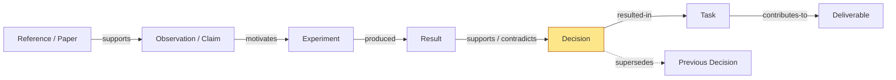
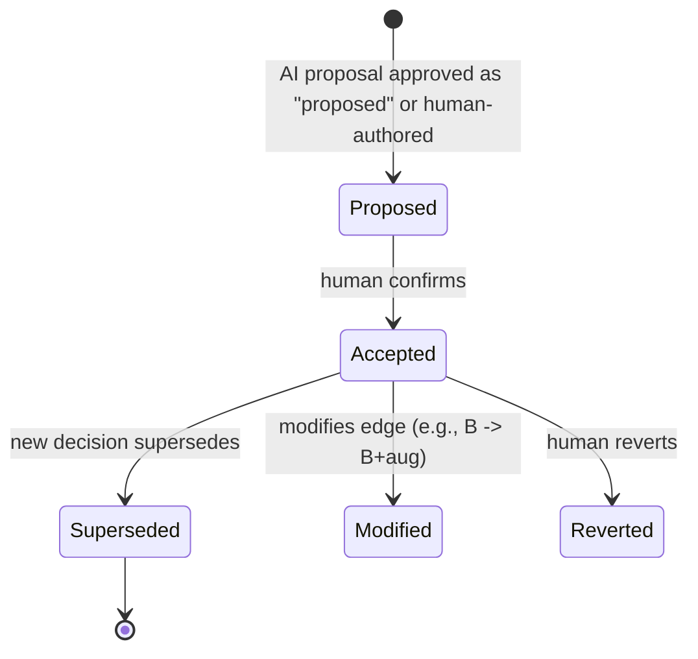
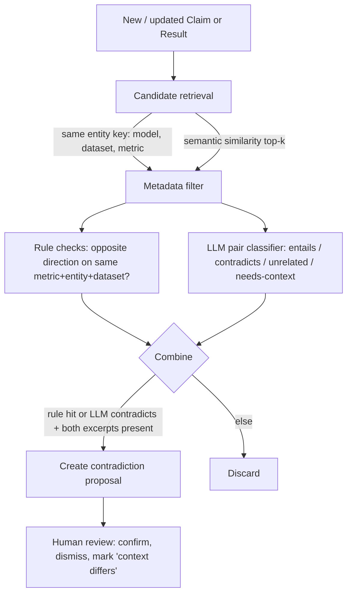
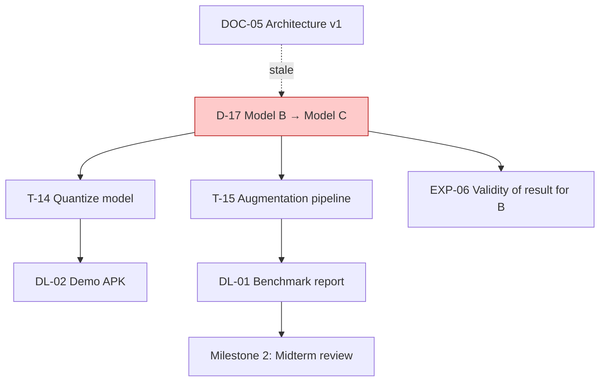
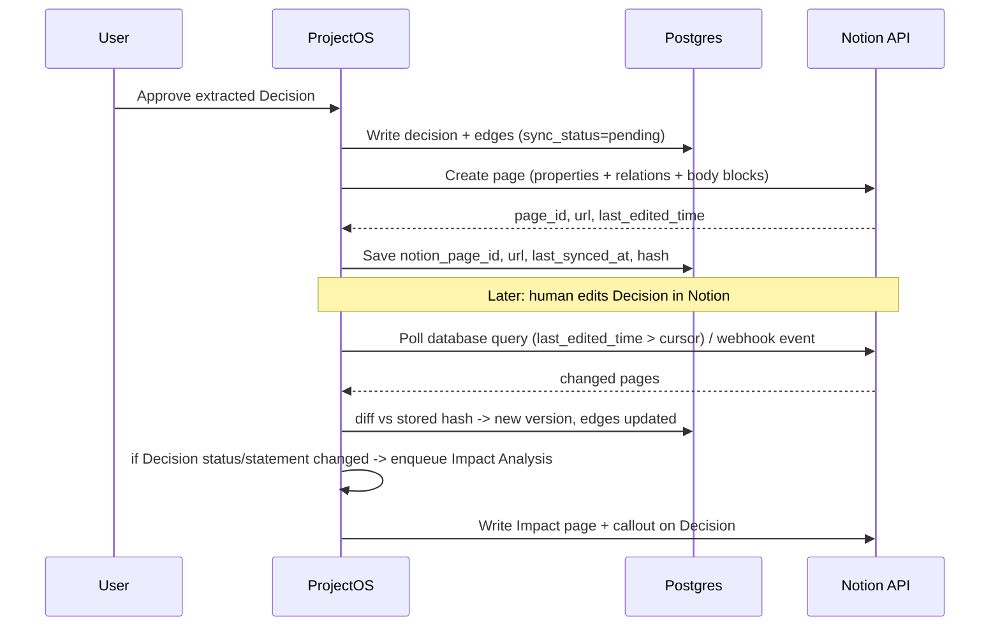
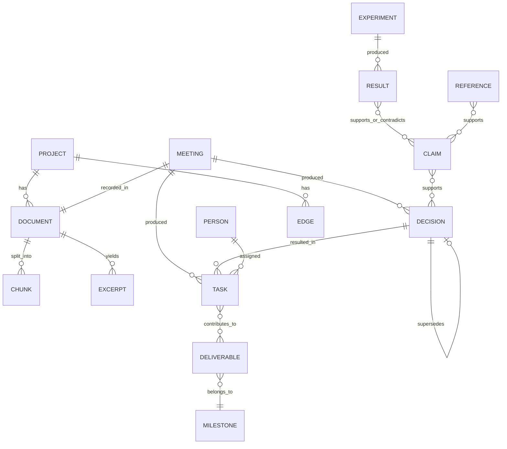
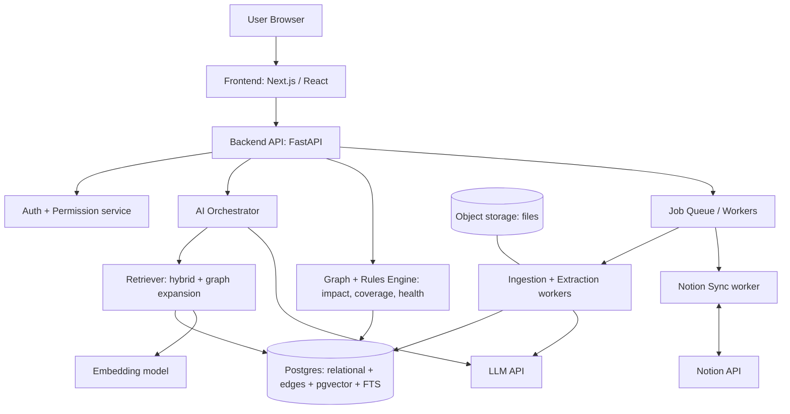
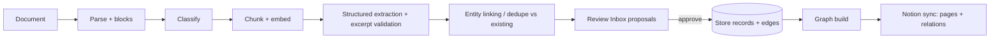
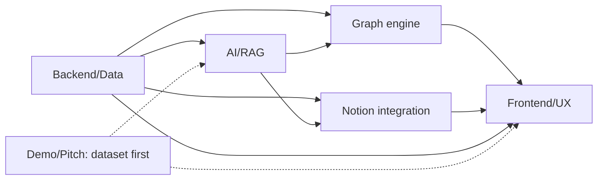

# ProjectOS — Project Intelligence Workspace
## Product Requirements Document (PRD) · KBC-NOTION-02 · Kaun Banega Codepati 2026 (Kinetex Lab × Notion)

**Version:** 1.0 (hackathon build edition) · **Working name:** ProjectOS (alternatives: Project Brain, Lineage)

---

### 0. Reading Guide, Tagging Convention, and Assumptions

**Important note on the source material.** The official problem-statement PDF was not available as a readable file to me when this PRD was written; I worked from the faithful summary of KBC-NOTION-02 contained in the brief (mandatory requirements, advanced layer, reference scenario, deliverables, judging criteria, and the "no template/iframe/hyperlink" constraint). Every place where the official text is silent is marked as an **Assumption (A-n)**. **Before submission, the team should diff Section 44 (Competition Alignment) against the actual PDF.**

Every requirement and feature in this document carries one of three provenance tags:

| Tag | Meaning |
|---|---|
| **[OFFICIAL]** | Explicitly required or listed in the KBC-NOTION-02 statement (mandatory or advanced layer). |
| **[EXT]** | Strongly aligned extension: not mandated, but directly strengthens an official requirement. |
| **[INNOV]** | Our deliberate product innovation to differentiate. |

Priority tags: **P0** = must work live in the demo · **P1** = should work, partially acceptable · **P2** = future roadmap.

**Assumptions register**

| ID | Assumption |
|---|---|
| A-1 | The team has 4–6 students and roughly 2–4 build weeks (or a compressed hackathon equivalent). Plan scales down gracefully (Section 42). |
| A-2 | Judges will have the live Notion workspace visible during the demo and may inspect it. |
| A-3 | A public Notion integration (OAuth) or an internal integration token is acceptable for authentication. We build with an internal token first, OAuth as P1. |
| A-4 | Sample project data may be synthetic but must be realistic and fully ingestible by the real pipeline. |
| A-5 | An external LLM API (e.g., Claude) is allowed. No on-prem requirement. |
| A-6 | "Permission-aware collaboration between multiple project teams" is judged by demonstration of at least two teams with different visibility, not by enterprise IAM. |

---

## 1. Executive Summary

**What we are building.** ProjectOS is a *reasoning and memory layer on top of Notion* for research teams, hackathon teams, and capstone projects. Teams keep working in Notion (docs, databases, tasks). ProjectOS ingests their messy material (meeting notes, papers, experiment logs, datasets, chats), extracts structured knowledge (claims, observations, experiments, results, decisions, tasks, owners), writes it into **structured, relation-linked Notion databases**, and builds an **evidence graph** over it. The graph powers source-cited answers, decision lineage, contradiction/staleness detection, evidence coverage, and change-impact analysis.

**Who it is for.** Student research teams, hackathon teams, capstone groups, academic labs, and faculty mentors who need traceability.

**The problem.** Project knowledge is fragmented across documents and chats. Weeks later nobody can say *why* a decision was made, *which experiment* supports it, *which tasks* depend on it, or *what breaks* if it changes. Existing tools store the latest state; none preserve the reasoning chain.

**Why existing workflows fail.** Notion stores pages and databases but does not know that "Decision D-17 rests on Experiment EXP-06, which contradicts Paper R-02, and blocks Task T-14." Task trackers track execution without evidence. Chatbots answer fluently but cannot show a verifiable chain, and silently blend sources and guesses.

**How it works.** Ingest → extract (with human review) → write to Notion → build typed graph → answer/analyze with citations → detect conflicts → simulate decision changes → report weekly.

**Why Notion matters.** Notion is the *human-owned, collaborative knowledge layer*. Humans edit decisions, owners, deadlines, and rationale in Notion; ProjectOS syncs those edits, enriches them, and writes back derived links, statuses, reports, and impact pages. Without Notion, ProjectOS has no source of truth; without ProjectOS, Notion has no reasoning layer.

**What makes it different.** The combination of **Decision Lineage ("Why?")**, **Decision Time Machine**, **Contradiction Radar**, **Evidence Coverage**, and **explainable Change-Impact Analysis**, built on explicit, typed, provenance-tagged relationships rather than opaque AI scores.

**Strongest demo moment.** The presenter changes one decision (*Model B → Model C*) in Notion. Within seconds, ProjectOS shows an explainable impact tree: *"Task T-14 is potentially affected because it depends on Decision D-17 via Deliverable DL-02,"* and writes an Impact page back into Notion, all traceable to sources.

---

## 2. Product Vision

> **"Your project remembers what happened. ProjectOS remembers why."**

A world where any team member, mentor, or successor can open a project and, within a minute, answer: *What did we decide? Why? Based on what? What depends on it? Is it still valid? What happens if we change it?* The project becomes **traceable, explainable, and continuously organized** instead of decaying into a pile of documents.

## 3. Problem Statement

**[OFFICIAL context]** Academic projects, hackathons, and research teams generate fragmented information (problem statements, papers, datasets, experiment logs, meeting notes, decisions, tasks, code references, documentation, discussions) spread over documents and chats. Teams lose track of why decisions were made, which experiments produced which results, which tasks depend on which, and which evidence supports which conclusions.

**Our framing.** The failure is not *storage* but *lost structure*: the relationships among evidence, decisions, and work are never recorded, so they evaporate. The problem statement for ProjectOS is:

> *How might we capture and maintain the reasoning structure of a project (evidence → decision → work → deliverable) so that it stays queryable, verifiable, and dependency-aware as the project evolves?*

## 4. Problem Context

- **Churn:** Student teams change members every semester; knowledge leaves with people.
- **Velocity:** Experiments and decisions happen faster than documentation.
- **Reproducibility:** Reviewers and mentors need to trace conclusions to evidence.
- **Tool sprawl:** Chat (WhatsApp/Discord/Slack), docs, Notion, notebooks, GitHub.
- **Silent staleness:** Old architecture docs remain "authoritative" long after the design changed.
- **Invisible dependencies:** Changing a model choice silently invalidates tasks, benchmarks, and slides.

## 5. Target Users

Primary: student research/capstone teams, hackathon teams, academic labs. Secondary: faculty mentors/reviewers, startup R&D squads, small engineering teams.

## 6. User Personas

| Persona | Role | Goals | Frustrations | What ProjectOS gives them |
|---|---|---|---|---|
| **Ananya, Researcher** | Runs experiments | Find prior results, avoid duplicate experiments, cite evidence | Results buried in notebooks and chat | Experiment ledger, evidence search, Missing-Evidence flags, auto experiment summaries |
| **Rohan, Project Lead** | Owns delivery | Know decisions, blockers, risks, milestone health | Can't see what's actually at risk; meeting actions get lost | Dashboard, project health dimensions, impact analysis, meeting→task pipeline, weekly report |
| **Meera, Team Member** | Implements tasks | Understand *why* a task exists, what it depends on | Tasks without context | Task view with upstream decision/evidence and "Why?" |
| **Dr. Iyer, Faculty Mentor** | Reviews | Traceability, rigor, progress without attending every meeting | Can't verify claims | Evidence coverage view, lineage, weekly report with verified vs AI-generated separation |
| **New joiner (cross-role)** | Onboarding | Catch up quickly | No history | Decision Time Machine + source-cited Q&A |

## 7. Current Workflow and Pain

```
Meeting happens → someone writes notes (maybe) → notes pasted in Notion/Docs
→ action items live in notes, maybe copied to a task board
→ experiment results live in notebooks / chat screenshots
→ decision lives in someone's memory or one sentence in notes
→ weeks later: "why Model B?" → 40 minutes of searching, no certain answer
```

Pain points: (1) no link between decision and evidence; (2) tasks disconnected from rationale; (3) contradictions unnoticed; (4) stale docs treated as truth; (5) impact of changes discovered late, usually during integration or presentation.

## 8. Product Thesis

1. Projects are **reasoning processes**, not file collections.
2. The valuable asset is the **typed relationship** between pieces of knowledge, with provenance.
3. AI is best used to *propose* structure and *interpret* it; **deterministic graph logic should compute** impact and coverage.
4. Humans own state changes that matter; the system makes the cost of keeping structure near zero.
5. The value compounds: every meeting, experiment, and decision enriches the graph.

## 9. Proposed Solution

ProjectOS is a web app + backend + Notion integration comprising:

1. **Ingestion & Extraction Engine** → structured candidates with source excerpts.
2. **Review Inbox** (human-in-the-loop) → approve/edit/reject.
3. **Notion Sync Engine** → structured, relation-linked databases + write-back pages.
4. **Evidence Graph** (relational edge tables, typed, provenance-tagged).
5. **Intelligence Services:** Cited RAG, Decision Lineage, Time Machine, Contradiction Radar, Evidence Coverage, Impact Analysis, Weekly Report.
6. **Web UI** focused on answering "What is happening, why, and what if?"

## 10. Core Product Principles (Guardrails)

1. Source-grounded answers over confident generation.
2. Human approval for important state changes.
3. Explicit relationships over invisible AI assumptions.
4. AI-generated content is always visually distinguishable from verified source information.
5. Notion is functionally integrated (read, write, relate, sync back), never decorative.
6. Project history stays recoverable (append-only versions; supersede, never overwrite).
7. Every major insight is traceable to sources.
8. Impact analysis is explainable (path-based), not a score.
9. Avoid feature bloat; every screen serves the core chain.
10. Build a coherent product, not a collection of demos.

## 11. Product Differentiation

Differentiation matrix (conceptual):

| Dimension | Notion | Jira/Trello | Generic RAG chatbot | Doc Q&A | Meeting summarizers | Research-mgmt tools (reference managers etc.) | **ProjectOS** |
|---|---|---|---|---|---|---|---|
| Primary unit | Pages / databases | Tickets | Text chunks | Document chunks | Meeting transcript | Papers / citations | **Claims, decisions, experiments, tasks + typed edges** |
| Stores rationale & alternatives of decisions | Only if users write it | Typically not structured | No | No | Sometimes in summary text | No | **Yes, structured Decision records with evidence links** |
| Answers cite sources | n/a | n/a | Varies | Usually | Usually to transcript | n/a | **Yes, to Notion page/block + excerpt, with status** |
| Cross-source contradiction/staleness detection | No (not a design goal) | No | Not by default | Not by default | No | No | **Yes (Contradiction Radar), human-reviewed** |
| Dependency-aware change impact | Manual relations only | Issue links, manual | No | No | No | No | **Yes, graph-derived and explainable** |
| Temporal reasoning history | Page history (not semantic) | Ticket history | No | No | Per-meeting | No | **Decision Time Machine** |
| Human-vs-AI provenance per fact | Not applicable | Not applicable | Typically not exposed | Typically not exposed | Typically not exposed | n/a | **First-class on every node/edge** |

*Positioning note:* these are conceptual characterizations of tool categories, not claims about specific product roadmaps; products evolve, so verify before quoting competitors on stage.

---

## 12. Feature Overview

| ID | Feature | Tag | Priority | Demo scene |
|---|---|---|---|---|
| F1 | Knowledge ingestion (upload / Notion import / paste) | OFFICIAL | P0 | 1 |
| F2 | Structured extraction (claims, experiments, decisions, tasks, owners) | OFFICIAL (meeting→decisions/tasks) | P0 | 2 |
| F3 | Review Inbox (human approval) | EXT | P0 | 2 |
| F4 | Notion workspace automation (DB creation, records, relations, write-back) | OFFICIAL | P0 | 3 |
| F5 | Traceable knowledge (source links on every record) | OFFICIAL | P0 | 3–5 |
| F6 | Evidence Graph | OFFICIAL (advanced) | P0 | 4 |
| F7 | Decision management + "Why?" lineage | OFFICIAL (decision mgmt) / INNOV (lineage) | P0 | 5 |
| F8 | Experiment & task tracking | OFFICIAL | P0 | 2–3 |
| F9 | Intelligent search + cited RAG | OFFICIAL | P0 | 5 |
| F10 | Project health view | OFFICIAL | P0 | dashboard |
| F11 | Contradiction & stale-doc detection | OFFICIAL (advanced) | P0 (narrow) | 6 |
| F12 | Change-impact analysis | OFFICIAL (advanced) | P0 | 7 |
| F13 | Weekly research/project report + experiment summaries | OFFICIAL (advanced) | P0 (one report) | 8 |
| F14 | Decision Time Machine | INNOV | P1 | 7 |
| F15 | Missing-Evidence Detector / Claim coverage | INNOV | P1 | dashboard |
| F16 | Permission-aware multi-team access | OFFICIAL (advanced) | P1 | optional |
| F17 | Verified/AI/Human trust labels | INNOV (supports OFFICIAL traceability) | P0 | everywhere |
| F18 | Notion webhook/poll sync of edits | EXT | P0 (poll) / P1 (webhook) | 7 |

## 13. Detailed Functional Requirements

Each requirement uses format **FR-x.y**. Acceptance criteria (AC) are testable.

### 13.1 Project & Workspace Setup (EXT)
- **FR-1.1** User can create a Project with name, description, team(s), and members. *AC:* Project row created; unique `project_id`.
- **FR-1.2** User connects Notion (token or OAuth) and selects a parent page. *AC:* Connection test returns workspace name; scopes validated.
- **FR-1.3** "Bootstrap Workspace" creates the 10 Notion databases with the schemas in Section 20 under the parent page, with relation properties wired. *AC:* All databases exist; relations navigable in Notion; DB IDs stored in `notion_databases` table. Idempotent (re-running doesn't duplicate).

### 13.2 Knowledge Ingestion (OFFICIAL, P0)
- **FR-2.1** Accept: PDF, DOCX, MD, TXT, CSV (experiment logs), pasted text, and Notion page import. P1: images/scans (OCR), URLs.
- **FR-2.2** Each upload creates a `Document` with `source_type`, hash, uploader, timestamp; deduped by content hash.
- **FR-2.3** Pipeline states: `uploaded → parsing → classifying → extracting → needs_review → committed | failed`. Retriable with idempotency key.
- **FR-2.4** Document classification into {meeting_note, paper/reference, experiment_log, design_doc, dataset_card, other}. *AC:* Classification shown with override option.
- **FR-2.5** Chunking preserves structure (headings, page numbers, paragraph offsets) so citations can point to exact excerpts.
- **FR-2.6** Every extracted object stores `source_document_id`, `char_start/char_end` (or page/block id), and a verbatim `excerpt`.

### 13.3 Structured Extraction (OFFICIAL meeting→decisions/tasks; EXT for claims)
- **FR-3.1** From a meeting note, extract: topics, attendees, observations/claims, experiments mentioned (with metrics), decisions (+ rationale + alternatives), action items (+ owner, deadline), dependencies, references mentioned.
- **FR-3.2** Extraction uses schema-constrained LLM output (JSON schema). Every item includes `excerpt`, `extraction_confidence_label` ∈ {explicit, implied}, and `needs_attention` flag. *No numeric "AI confidence" is displayed;* explicit/implied is a categorical, explainable label (does the text literally state it?).
- **FR-3.3** Owner resolution: names matched against project members (fuzzy); unresolved → "Unassigned (needs owner)" flag.
- **FR-3.4** Date resolution: relative dates ("by Friday") resolved against meeting date; ambiguous → flagged.
- **FR-3.5** Entity linking: extracted experiment/decision/task candidates matched against existing records (by ID, title similarity, and metadata) to propose *update/link* rather than duplicate.

### 13.4 Review Inbox (EXT, P0 — core to trust)
- **FR-4.1** All AI-extracted items appear as *proposals* grouped by source document, with excerpt highlights in the source viewer (split view).
- **FR-4.2** Actions: Approve, Edit-then-approve, Reject, Merge-with-existing. Bulk approve for low-risk types (tasks); decisions always individually confirmed.
- **FR-4.3** On approval, system writes to internal DB and Notion in one logical transaction (internal first, Notion second with retry; status `synced | pending | failed`).
- **FR-4.4** Rejections are stored (with optional reason) to avoid re-proposing the same item and to measure extraction precision.

### 13.5 Experiments (OFFICIAL, P0)
- **FR-5.1** Experiment record: hypothesis, setup (model/dataset/params), metrics, result summary, status {planned, running, complete, invalid}, owner, date, linked sources, linked decisions.
- **FR-5.2** CSV experiment-log ingestion maps rows to Experiment Results (metric, value, split, dataset).
- **FR-5.3** Auto experiment summary (AI-generated, labeled) with link to underlying result rows. (OFFICIAL advanced)

### 13.6 Decisions (OFFICIAL, P0; lineage INNOV)
- **FR-6.1** Decision record: statement, status {proposed, accepted, superseded, reverted}, rationale, alternatives considered, decided-on date, decided-by, supporting evidence links, source meeting, version number, supersedes/superseded-by.
- **FR-6.2** Editing an accepted decision never mutates history: creates new version/new Decision record with `supersedes` edge; old stays queryable.
- **FR-6.3** "Why?" panel (Section 16).
- **FR-6.4** Decision change triggers Impact Analysis prompt (Section 18).

### 13.7 Tasks & Milestones (OFFICIAL, P0)
- **FR-7.1** Task: title, description, owner, due, status {todo, in progress, blocked, done}, priority, `originating_decision/meeting`, dependencies (task→task, task→decision, task→deliverable).
- **FR-7.2** Tasks created from approved action items carry the source excerpt as "Why does this exist?" context.
- **FR-7.3** Milestones group deliverables and tasks; progress derived (not manual).
- **FR-7.4** Blocked-task logic: a task is *blocked* if a `depends-on` upstream task is incomplete or an upstream decision is `superseded/proposed` (derived flag, human can override).

### 13.8 Intelligent Search & Cited Q&A (OFFICIAL, P0)
- **FR-8.1** Unified search (keyword + semantic) across documents, claims, decisions, experiments, tasks.
- **FR-8.2** AI Assistant answers project questions with **inline numbered citations**, each linking to (a) the internal record, (b) the Notion page URL, (c) the excerpt.
- **FR-8.3** If retrieved evidence is insufficient the assistant must say so ("I couldn't find support in project sources") rather than guess.
- **FR-8.4** Answers display an **Answer Provenance bar**: N sources, N graph hops used, which statements are directly quoted vs synthesized.
- **FR-8.5** Retrieval respects the requester's permissions (Section 21).

### 13.9 Project Health (OFFICIAL, P0)
- **FR-9.1** Dashboard shows six *derived* dimensions (Section 14.8), each with the concrete list of items behind it (click-through), not a single magic score.

### 13.10 Reports (OFFICIAL advanced, P0 one report)
- **FR-10.1** Generate weekly report for a date range; saved as a Notion page and in-app. Sections defined in Section 14.7. Each statement is tagged `[Source]`, `[Derived]`, or `[AI summary]`.

### 13.11 Notion Sync (OFFICIAL, P0)
- See Section 20 for full behavior. Key ACs: create, update, read-back; relation properties persisted; sync status per record; conflict surfacing.

---

## 14. Advanced Intelligence Features

### 14.1 "Why?" Decision Lineage — [INNOV on OFFICIAL decision mgmt/traceability], P0
*Why it exists:* the central failure in the problem statement. *Who:* everyone, esp. mentors/new joiners. *Data:* Decision, edges `supports/contradicts/derived-from/discussed-in/resulted-in/contributes-to`, Evidence, Experiments, Papers, Tasks, Deliverables. *UI:* two-sided panel — **Upstream (Evidence)** and **Downstream (Consequences)**, plus Rationale, Alternatives, People, Date, and **Later evidence** (confirming/challenging) with trust badges. *Notion:* the Decision page contains relation properties and a generated "Lineage" section (synced block text with links). *Implementation:* recursive graph traversal with edge-type filters; LLM only writes a short optional narrative labeled AI summary. *Demo:* Scene 5.

### 14.2 Decision Time Machine — [INNOV], P1
A timeline slider over `decision_versions`. Choosing a date shows the **project belief state as-of that date**: active decisions, their evidence then available, and which later items supersede them. Implementation: all graph nodes/edges carry `valid_from`, `valid_to` (bitemporal-lite: `recorded_at` vs `effective_at`). Query = filter on `effective_at <= T AND (valid_to IS NULL OR valid_to > T)`. *Demo:* Scene 7 (scrub from A → B → B+aug → C).

### 14.3 Contradiction Radar — [OFFICIAL advanced: "AI detection of contradictory notes or stale documentation"], P0 narrow
Detailed in Section 17.

### 14.4 Missing-Evidence Detector / Claim Coverage — [INNOV], P1
For each *Claim* with an evaluative form ("X is better than Y"), a **checklist-based sufficiency profile** is evaluated, e.g. {comparison baseline present?, metric value present?, dataset named?, sample size/runs reported?, variance or statistical test reported?}. Missing fields are listed. The badge says **"Evidence incomplete: no baseline comparison, no run count"** — never "false". The checklist is configurable per claim type (rule templates), the LLM only *extracts* which fields are present from linked results; the *judgment of completeness is rule-based*.

Claim status taxonomy (explainable by construction):

| Status | Rule |
|---|---|
| Well-supported | ≥1 linked result evidence meeting sufficiency checklist, no open contradiction, source not stale |
| Partially supported | Evidence linked but checklist incomplete |
| Unsupported | No evidence edge |
| Potentially contradicted | ≥1 open (unresolved) contradiction edge |
| Potentially stale | Source superseded or newer related records exist |

### 14.5 Meeting → Reasoning Pipeline — [OFFICIAL meeting→decisions/tasks; EXT depth], P0
`Meeting → Topics → Claims/Observations → Experiments → Decisions(+rationale+alternatives) → Tasks(+owner+due) → Dependencies → Notion updates`. Output shown in Review Inbox grouped hierarchically so a human can see *how a task came from a decision came from an observation*.

### 14.6 Experiment Summaries — [OFFICIAL advanced], P0/P1
Per experiment: structured summary (setup, result table, comparison to baseline, linked decisions). Numbers are copied from result rows (not regenerated by the LLM); prose is labeled AI summary.

### 14.7 Weekly Intelligence Report — [OFFICIAL advanced + EXT], P0
Sections: experiments completed · major findings · decisions made · decisions changed · tasks completed · tasks blocked · unresolved contradictions · stale information · missing evidence · important project changes · upcoming work · milestone status · risks. Section content is assembled by **deterministic queries** over the time window; the LLM only produces a short executive paragraph (labeled AI summary). Output: in-app page + Notion page under "Reports".

### 14.8 Project Health Dimensions — [OFFICIAL "project health view"; derivation EXT], P0

| Dimension | Derived from (concrete state) | Presented as |
|---|---|---|
| Execution | % tasks done vs planned this milestone; # overdue; # blocked | Counts + mini bar |
| Evidence coverage | # claims per status (Section 14.4) | Stacked bar with drill-down |
| Documentation health | # documents flagged stale; # orphan records (no source link); age of key docs | Counts |
| Decision stability | # decisions changed in last N days; # superseded; # decisions lacking rationale/evidence | Counts + list |
| Dependency health | # tasks depending on superseded/proposed decisions; # circular/broken deps | Counts |
| Knowledge consistency | # open contradictions; # resolved | Counts |

Each dimension shows a **traffic-light only if a documented threshold rule is met** (e.g., red if any task depends on a superseded decision). Thresholds are visible in a tooltip. No weighted composite score.

---

## 15. Evidence / Knowledge Graph

### 15.1 Design stance
The graph is a **derived intelligence layer** persisted in Postgres (nodes + typed edge tables). Notion holds human-readable records and key relation properties; the graph holds *all* typed edges, provenance, temporal validity, and AI proposals. (Rationale for relational-first: Section 34.)

### 15.2 Node types
Project · Document · Meeting · Reference(Paper) · Claim · Observation · Experiment · ExperimentResult · Decision · Rationale (embedded in Decision) · Task · Milestone · Deliverable · Person · Assumption · Source(Excerpt).

### 15.3 Edge types

| Edge | From → To | Meaning | Typical origin |
|---|---|---|---|
| `references` | Document/Claim → Reference | cites a paper | system-derived |
| `discussed-in` | Claim/Decision/Experiment → Meeting | where it was discussed | system-derived |
| `produced` | Experiment → ExperimentResult | outputs | human/system |
| `supports` | Evidence(Result/Reference/Observation) → Claim/Decision | evidence backs it | human or AI-inferred (reviewed) |
| `contradicts` | Claim/Result → Claim/Decision | conflict | AI-inferred (reviewed) |
| `resulted-in` | Decision → Task | task exists because of decision | system-derived on approval |
| `depends-on` | Task/Deliverable/Decision → Task/Decision/Deliverable | execution/logical dependency | human or AI-inferred (reviewed) |
| `contributes-to` | Task → Deliverable/Milestone | | human/system |
| `assigned-to` | Task/Decision → Person | | human/system |
| `supersedes` | Decision/Document vN+1 → vN | history | system-derived |
| `modifies` | Decision → Decision | partial change (e.g., B → B+aug) | human |
| `affects` | Decision → any | computed impact (materialized only in analysis runs) | system-derived |
| `validates` / `invalidates` | Result → Claim/Assumption | stronger forms of supports/contradicts | AI-inferred (reviewed) |
| `assumes` | Decision/Task → Assumption | | human/AI-reviewed |

### 15.4 Provenance on every node and edge
`origin ∈ {human_authored, system_derived, ai_inferred}` and `review_status ∈ {unreviewed, approved, rejected}`. UI rendering rule: **AI-inferred + unreviewed edges are drawn dashed and excluded from Impact Analysis default scope** (toggle "include proposed links"). This directly prevents unreviewed AI guesses from driving conclusions.

### 15.5 Reference chain (canonical)



### 15.6 UI: Progressive disclosure
Never render the full graph by default. Default is **focused subgraph (ego network, depth 2)** around a selected node with edge-type filters and a provenance legend. A "Show full project graph" option is available with clustering by type.

---

## 16. Decision Intelligence

### 16.1 Decision lifecycle


### 16.2 "Why?" lineage view — layout
```
┌────────────────────────────────────────────────────────────────┐
│ D-17  Use Model B (MobileNetV3 + augmentation)   [Accepted]    │
│ Decided 21 Sep by Rohan · Source: Meeting M-04 · v2            │
├───────────────────────────┬────────────────────────────────────┤
│ WHY (Upstream)            │ SO WHAT (Downstream)               │
│ • Rationale (human)       │ • Tasks resulting (3)              │
│ • Evidence (4)            │ • Deliverables depending (2)       │
│   EXP-06 result  ✔ source │ • Other decisions depending (1)    │
│   R-03 paper     ✔ source │                                    │
│ • Alternatives considered │ LATER EVIDENCE                     │
│ • People involved         │ • EXP-09 challenges ⚠ (open)       │
├───────────────────────────┴────────────────────────────────────┤
│ Timeline: v1 Use A → v2 Use B → v3 B+aug      [Open Time Machine]│
│ Trust legend:  ● Verified source  ◐ AI-derived  ✓ Human-approved │
└────────────────────────────────────────────────────────────────┘
```

### 16.3 Required decision fields (completeness drives "decisions with rationale" metric)
statement · rationale · alternatives · evidence links · decided-by · decided-on · source meeting · status · version · supersedes.

### 16.4 Decision Time Machine implementation
Append-only `decision_versions` table; graph edges have `effective_from/to`. Query as-of date T reconstructs active set. UI: timeline with markers for decisions, results, contradictions; clicking a marker shows what triggered the change (edge `supersedes` + the evidence edges recorded at that time).

---

## 17. Contradiction Detection (Contradiction Radar + Stale Detector)

**Goal:** surface *potential* contradictions and stale documentation for human review. The system never decides truth.

### 17.1 Pipeline (hybrid deterministic + AI)



1. **Normalization:** claims are extracted as `(subject, predicate, object/metric, direction, dataset, condition, value?)` where possible.
2. **Candidate generation:** same subject/metric (metadata) ∪ nearest neighbors (embeddings). Reduces LLM calls and false positives.
3. **Deterministic check (preferred):** same subject + metric + dataset + split, opposite direction or value delta beyond a configured tolerance → flagged by rule.
4. **LLM classification:** for textual claims lacking structure; classifier must output a label **and cite both excerpts**; "needs-context" is a legal answer (e.g., different dataset), reducing false alarms.
5. **Output card:** conflicting claims, source docs and dates, linked experiments, affected decisions (via graph), status of each source (draft/approved/superseded), and "what needs human review".

### 17.2 Stale-documentation detection (rule-first)
A document is *potentially stale* if: (a) a newer document/decision `supersedes` or `modifies` the entity it describes; (b) it asserts a "current" state about an entity (e.g., "Architecture v1 is current") while records show a newer version active; (c) not edited since a decision it depends on changed. LLM assists only to extract "this doc claims X is current".

### 17.3 UX
Radar list sorted by *affected decisions count* (derived, explainable), side-by-side excerpts, actions: **Confirm contradiction / Dismiss / Context differs / Create task to resolve**. Confirmation writes a `contradicts` edge (human-approved) and a Notion "Contradiction" callout on involved pages.

### 17.4 Known limits
False positives from differing conditions; negation subtleties; numeric claims in tables. Mitigations: structured keys, needs-context label, mandatory excerpts, human review, tracked precision (Section 39).

---

## 18. Change-Impact Analysis

**[OFFICIAL advanced]** — implemented primarily by **deterministic graph traversal**; AI only phrases explanations.

### 18.1 Trigger
- A user edits/supersedes a Decision (in app or in Notion, detected by sync), or clicks "Simulate change" (what-if, without committing).

### 18.2 Algorithm
1. Start node = changed Decision (or its edges). 
2. Traverse **forward** along `resulted-in`, `depends-on` (reverse direction so dependents are found), `contributes-to`, `assumes`, `modifies`, `supports (as target of the decision)`. Default to `approved` edges; toggle to include AI-proposed edges.
3. Record each reached node with: **path** (list of edges), **hop distance**, **relationship classes** (execution, evidence, documentation, deliverable).
4. Classify impact category by node type: Task (rework/re-plan), Experiment (rerun/validity), Deliverable (content update), Document (stale), Milestone (schedule), Decision (re-evaluation), Assumption.
5. Rank by deterministic rules: hop distance ascending, deliverable/milestone proximity, due date proximity, status (in-progress > done > todo for rework cost). **No arbitrary AI score.**
6. LLM adds one-sentence plain-language explanation per node **from the path**, plus suggested actions (e.g., "re-run EXP-06 with Model C"), clearly labeled suggestions.
7. Human confirms which items to act on → system can create Notion tasks/comments, flag docs stale, and set tasks "needs re-evaluation".

### 18.3 Output example (explainable)

> **T-14 "Quantize model for Android" — potentially affected (hop 1).**
> Because: `T-14 --resulted-in←-- D-17 (Use Model B)`. *Suggested:* re-evaluate quantization method for Model C.
> **DL-02 "Demo APK" — potentially affected (hop 2).** Path: `D-17 → T-14 → DL-02`.
> **DOC-05 "Architecture v1" — potentially stale.** Path: `D-17 ←describes— DOC-05`.

### 18.4 Impact tree diagram


### 18.5 Limitations
Impact is only as complete as recorded edges. We surface **"graph completeness hints"** (e.g., tasks with no upstream links) and allow users to add missing dependencies during review.

---

## 19. AI / RAG Architecture

### 19.1 Where deterministic logic beats generative AI

| Capability | Mechanism | Rationale |
|---|---|---|
| Impact analysis | Graph traversal over approved edges | Needs reproducibility and explainability |
| Evidence coverage status | Rule checklist over linked records | Auditability |
| Project health | SQL aggregates | Concrete state |
| Blocked/overdue | Rules | Exact |
| Weekly report data | Queries | Facts must be exact |
| Candidate retrieval for contradictions | Metadata + embeddings | Cheap, high recall |
| Extraction | LLM (schema-constrained) | Unstructured text understanding |
| Contradiction judgement on text | LLM classifier w/ excerpts | Language nuance |
| Answer synthesis | LLM over retrieved context | Fluency, with citation constraints |

### 19.2 Ingestion
`file → parser (PyMuPDF/pdfplumber, python-docx, markdown, csv) → normalize to blocks with offsets → classify → chunk (structure-aware, ~300–500 tokens with overlap, preserving heading path) → embed → store chunks (pgvector) + FTS tsvector → extraction jobs`. OCR (Tesseract) is P1.

### 19.3 Extraction
Two-pass for reliability: **Pass 1** segment the document (topics, speakers, sections); **Pass 2** schema-constrained extraction per segment with required `excerpt`. Post-validation: excerpt must literally appear in source (substring/fuzzy match); items failing validation are discarded or flagged. This is the primary **hallucination guard**.

### 19.4 Retrieval ("Graph-RAG")

```mermaid
flowchart LR
  Q[User question] --> P[Permission filter: allowed project/team/source scopes]
  P --> I[Intent + entity detection: decision? experiment? task?]
  I --> H[Hybrid search: BM25 + vector]
  H --> M[Metadata filters: type, date, status]
  M --> G[Graph expansion: 1-2 hops via approved edges from top hits]
  G --> C[Context assembly: ordered records + excerpts + provenance labels]
  C --> L[LLM answer with mandatory citation IDs]
  L --> V[Citation validator: every [n] resolves to an included excerpt]
  V --> A[Answer + citations + provenance bar]
```

- **Citation validator:** answer is rejected/regenerated if it cites IDs not in context or has uncited factual sentences (best-effort heuristic).
- **Grounding mode:** system prompt requires "answer only from provided context; otherwise state insufficiency".
- **Answer format:** short answer → "Evidence" list → "Related decisions/tasks" → "Gaps or conflicts found" (if radar flags exist on cited items).

### 19.5 Models (suggested; swap freely)
- LLM: a Claude Sonnet-class model for extraction/Q&A/classification (structured outputs / tool-use JSON); cheaper Haiku-class for classification at scale. *Verify the current model names, pricing and limits in provider docs at build time.*
- Embeddings: a hosted embedding API or an open-source model (e.g., bge-small / e5) run locally to avoid cost and latency.

### 19.6 Evaluation (built in, small)
A "golden set" for the demo project: 10 questions with known source answers; 5 labeled contradictions (+ 5 non-contradictions); extraction ground truth for 3 meetings. Run as a script; results appear on an internal "Quality" page (also useful in pitch).

---

## 20. Notion Integration

### 20.1 Principles
1. **Notion = collaborative knowledge/documentation layer and human source of truth** for human-editable fields.
2. **ProjectOS DB = derived intelligence layer**: graph edges, provenance, embeddings, AI proposals, temporal versions.
3. The integration must be **bidirectional, relational, and visibly useful**: create databases, create/update pages, maintain relation properties, read human edits, write back analyses.

### 20.2 Notion databases (created by Bootstrap)

| Notion DB | Key properties | Relation properties |
|---|---|---|
| Projects | Name, Status, Lead, Dates | → Milestones |
| Meetings | Title, Date, Attendees, Source file, Extraction status | → Decisions, Tasks, Experiments, Claims |
| References | Title, Authors, Year, URL, Key takeaways | → Claims, Decisions |
| Claims | Statement, Type, Status (coverage), Source excerpt | → Evidence, Decisions, References, Contradictions |
| Evidence | Title, Type (Result/Paper/Observation), Excerpt, Source URL, Verified? | → Claims, Decisions, Experiments |
| Experiments | ID, Hypothesis, Model, Dataset, Metrics (text), Status, Owner, Date | → Results(Evidence), Decisions, Tasks |
| Decisions | ID, Statement, Status, Rationale, Alternatives, Decided on, Decided by, Version | → Evidence, Tasks, Supersedes, Superseded by, Meeting, Deliverables |
| Tasks | Title, Status, Owner (Person), Due, Priority, Blocked? | → Decision (origin), Depends on, Deliverable, Milestone |
| Milestones | Name, Due, Progress (rollup) | → Tasks, Deliverables |
| Deliverables | Name, Type, Status, Due | → Tasks, Milestone, Decisions |

Additional pages (generated): **Weekly Reports** DB; **Impact Analyses** DB; **Contradiction Reports** (callouts or DB). Every page created includes hidden-ish properties: `POS_ID` (our UUID), `POS_Origin` (human/AI), `POS_Review` (status), `POS_Source` (URL back to app record), and `POS_Hash` (content hash for change detection).

### 20.3 Field ownership (source of truth matrix)

| Field class | Owner | Behavior |
|---|---|---|
| Title, status, owner, due, rationale text, alternatives, notes | **Notion (human)** | Edits in Notion are pulled into our DB; app edits are pushed to Notion |
| Relation properties for approved edges | **Shared**: written by us on approval; human edits in Notion are pulled and become `human_authored` edges | |
| AI summaries, coverage status, contradiction flags, impact results | **ProjectOS** | Pushed to Notion in designated read-only-by-convention properties/sections |
| Embeddings, graph provenance, versions | **ProjectOS only** | Not stored in Notion |

### 20.4 Synchronization



- **Change detection:** P0 = polling each synced DB every 20–30s using `last_edited_time` filter (plus a manual "Sync now" button). P1 = Notion webhooks (verify current availability/event types in Notion docs) with polling as fallback. Polling is deliberately the baseline because it needs no public endpoint and is simplest to demo reliably.
- **Idempotency:** All writes keyed by `POS_ID`; upsert by lookup. Retries use exponential backoff; Notion rate limit (documented average ~3 requests/second) handled by a token-bucket queue.
- **Content limits:** Notion rich-text objects have per-object length limits and block-append batches have size limits; long excerpts are split across blocks. Verify exact limits in current docs.
- **Conflict handling:** Each record stores `last_synced_hash` and `last_synced_notion_edited_time`. If both sides changed since last sync → mark `conflict`, keep both versions, show a diff in the **Sync Center** and ask the user to pick (default: Notion wins for human-owned fields, ProjectOS wins for derived fields).
- **Deletions:** Archiving in Notion → soft-delete in our DB (`archived=true`), edges retained with `valid_to` set; never hard-delete graph history.
- **Citations:** each citation resolves to `{internal_id, notion_page_id, notion_url, block_id?, excerpt, source_timestamp, origin}`. Where an excerpt comes from an uploaded file, the file is stored (and linked in a Notion "Source file" property or as a file block) and the excerpt is also stored in an Evidence page.

### 20.5 Notion permissions & capabilities required
Integration capabilities: read content, insert content, update content; (user information read if mapping owners to Notion users — P1). The integration must be explicitly shared with the parent page. Principle of least privilege: only the project parent page tree.

### 20.6 How we avoid "superficial integration"
Checklist (also usable as judging evidence):
- [ ] Databases are created programmatically by the app (Bootstrap).
- [ ] Records created from AI extraction after human approval, with relation properties populated.
- [ ] Human edits in Notion are detected and reflected in the app (and trigger impact analysis).
- [ ] App writes derived artifacts back (impact page, weekly report, contradiction callouts).
- [ ] Citations deep-link to Notion pages.
- [ ] Notion IDs persisted; sync status visible; conflicts handled.
- [ ] No iframes/static templates/hyperlink-only integration (explicitly forbidden by the brief).

### 20.7 Notion risks & fallbacks
Rate limits → queue + batching. Schema drift (user edits property names) → sync validator + "repair schema" action. API quirks (relations/rollups limits) → store critical edges in our DB too (already the design). Offline demo failure → pre-warmed workspace + recorded fallback clip (Section 30).

---

## 21. Permissions & Security

### 21.1 Permission model
`User → TeamMembership → Project permission (role) → Source scope (per document/record visibility) → Retrieval filter`

| Role | Capabilities |
|---|---|
| Owner/Lead | Manage project, approve decisions, run analyses, manage permissions |
| Researcher/Member | Create/edit assigned records, approve tasks/evidence, query |
| Reviewer/Mentor | Read-all within project, comment, no mutation (configurable) |
| Guest team | Read only records tagged with shared scope |

Every Document/Record has `visibility ∈ {project, team:<id>, private}`. **Retrieval filters are applied at query time in SQL (WHERE visibility IN user_scopes)** *before* vector/BM25 ranking and graph expansion, and graph expansion cannot cross into unauthorized nodes (those appear as "restricted node" placeholders in impact paths, so dependency awareness doesn't leak content).

### 21.2 Must-have (hackathon) vs production

| Area | Must-have for prototype | Production enhancement |
|---|---|---|
| AuthN | Simple login (e.g., Supabase/Auth.js; or Notion OAuth) | SSO, MFA |
| AuthZ | Project roles + visibility filters in all queries (tested with 2 teams) | Row-level security everywhere, policy engine |
| Notion tokens | Stored server-side, encrypted at rest, never sent to the client | KMS, rotation, per-user OAuth tokens |
| Secrets | Env vars / secret manager; no keys in repo | Vault, short-lived credentials |
| Retrieval | Permission filter before retrieval; unit test proving no leakage | Formal red-team tests |
| Notion permission alignment | Integration only has access to shared project page; mapping of app roles to Notion visibility documented | Per-user Notion OAuth so retrieval equals user's Notion access |
| Logging/audit | Append-only `audit_log` (who approved/changed what, AI vs human) | Immutable store, SIEM export |
| LLM data handling | Only project data sent; no training use per provider policy (verify) | Private deployments, data residency |
| Rate limiting | Basic per-user limits | WAF, abuse detection |
| Prompt injection | Treat document text as data; strip tool-like instructions; extraction has no tool access; outputs validated | Sandboxed pipelines, detectors |

*Note on prompt injection:* uploaded documents may contain instructions aimed at the LLM. Our extraction/Q&A calls have no write tools; all writes go through validated schemas and human review.

---

## 22. Data Model

### 22.1 Common columns (all entities)
`id (uuid, PK)` · `project_id` · `notion_page_id (nullable)` · `notion_url` · `origin (human_authored | system_derived | ai_inferred)` · `review_status (unreviewed | approved | rejected)` · `visibility` · `created_at` · `created_by` · `updated_at` · `valid_from` · `valid_to` · `version` · `archived` · `sync_status (synced|pending|failed|conflict)` · `last_synced_hash`.

### 22.2 Entities

| Entity | Purpose | Key fields | Relationships | Source / origin |
|---|---|---|---|---|
| **Project** | Scope container | name, description, notion_parent_id | has all below | Human |
| **Person** | Owner/attendee | name, email, aliases[], notion_user_id | assigned-to, attended | Human |
| **Document** | Any ingested artifact | title, doc_type, file_uri, content_hash, text_status, doc_date, supersedes_id | has Chunks, Excerpts | Upload/Notion |
| **Chunk** | Retrieval unit | document_id, heading_path, char_start/end, text, embedding, tsv | belongs to Document | System |
| **Excerpt (Source)** | Citable span | document_id, block_id/page, start, end, text | referenced by any node | System |
| **Meeting** | Meeting note record | date, attendees[], document_id, extraction_status | discussed-in edges | Human + system |
| **Reference** | Paper/external source | title, authors, year, url/doi, takeaway | supports claims | Human/AI-extracted, reviewed |
| **Claim** | Assertion (incl. observations) | statement, claim_type {observation, comparative, factual, assumption}, subject, metric, direction, dataset, status (coverage), source_excerpt_id | supported-by/contradicted-by | Mixed |
| **Experiment** | Unit of testing | code (EXP-06), hypothesis, model, dataset, params json, status, owner_id, run_date | produced Results | Human + AI-extracted |
| **ExperimentResult** | Measured output | experiment_id, metric, value, unit, split, n_runs, variance, baseline_ref, excerpt_id | supports/contradicts | CSV/Doc |
| **Decision** | Choice made | code (D-17), statement, rationale, alternatives[], status, decided_on, decided_by, meeting_id, version, supersedes_id | supported-by evidence; resulted-in tasks | Human-approved |
| **Assumption** | Underlying premise | statement, status | assumed-by decisions/tasks | Human/AI reviewed |
| **Task** | Executable work | code (T-14), title, status, owner, due, priority, origin_decision_id, blocked_flag | depends-on, contributes-to | Human-approved |
| **Milestone** | Time-bound goal | name, due, derived progress | has tasks/deliverables | Human |
| **Deliverable** | Output artifact | name, type, status, due | depends on tasks/decisions | Human |
| **Edge** | Typed relationship | from_type/id, to_type/id, edge_type, origin, review_status, rationale_text, excerpt_id, effective_from/to | — | Per origin |
| **Contradiction** | Flagged conflict | claim_a, claim_b, detection_method {rule, llm, both}, status {open, confirmed, dismissed, context_differs}, reviewer | links to affected decisions | AI-proposed, human-resolved |
| **StaleFlag** | Staleness | document_id, reason, triggering_record_id, status | | System |
| **ImpactAnalysis** | Saved run | trigger_decision_id, scenario {actual, what-if}, results json (nodes+paths), actions taken | | System + human |
| **Report** | Weekly report | period, sections json, notion_page_id | | System + AI-labeled text |
| **AuditLog** | Accountability | actor, actor_type {human, ai, system}, action, entity, before/after, timestamp | | System |
| **SyncState** | Notion cursors | database_id, last_cursor, last_run, errors | | System |

### 22.3 Temporal model
- **Edges and nodes are never destroyed**; "change" = close old row (`valid_to = now`), insert new version row.
- Two clocks: `recorded_at` (when the system learned it) and `effective_at` (when it was true in project world). Time Machine queries use `effective_at`; audit uses `recorded_at`.
- `decision_versions` view returns the chain by following `supersedes`/`modifies`.

### 22.4 ER overview


Graph note: `EDGE` is the canonical generic relation table; domain FKs like `task.origin_decision_id` are convenience caches kept consistent with edges.

---

## 23. System Architecture

### 23.1 High-level


### 23.2 Ingestion data flow


### 23.3 Query data flow
`Question → auth/permission scope → intent → hybrid retrieval → graph expansion → context assembly (with provenance labels) → LLM → citation validation → answer + citations + radar flags on cited items`.

### 23.4 Change-impact data flow
`Decision update (app or Notion poll) → create new version + supersedes edge → dependency resolution (graph traversal) → affected nodes with paths → LLM explanation per node → impact summary → suggested actions → human confirms → Notion tasks/comments/stale flags`.

### 23.5 Recommended diagrams for slides
(1) The canonical chain (15.5). (2) Architecture (23.1) simplified to 5 boxes. (3) Sequence of Notion sync (20.4). (4) Impact tree (18.4).

---

## 24. APIs (REST, JSON; `/api/v1`)

Auth: `Authorization: Bearer <session/JWT>`; all endpoints project-scoped and permission-checked.

| Area | Endpoint | Purpose |
|---|---|---|
| Projects | `POST /projects`, `GET /projects/{id}`, `GET /projects/{id}/health` | create/read/dashboard health |
| Notion | `POST /projects/{id}/notion/connect` | store token/parent page |
| | `POST /projects/{id}/notion/bootstrap` | create DBs (idempotent) |
| | `POST /projects/{id}/notion/sync` , `GET .../sync/status` | manual sync, status/conflicts |
| | `POST /projects/{id}/notion/conflicts/{id}/resolve` | resolve conflict |
| Ingestion | `POST /projects/{id}/documents` (multipart), `POST .../documents/import-notion` | upload/import |
| | `GET /documents/{id}`, `GET /documents/{id}/status`, `POST /documents/{id}/retry` | pipeline state |
| Review | `GET /projects/{id}/proposals`, `POST /proposals/{id}/approve|reject|merge`, `PATCH /proposals/{id}` | review inbox |
| Meetings | `GET /meetings`, `GET /meetings/{id}/structure` | meeting → reasoning tree |
| Experiments | `GET/POST/PATCH /experiments`, `GET /experiments/{id}/summary` | CRUD + auto-summary |
| Claims/Evidence | `GET /claims`, `GET /claims/{id}/coverage`, `POST /edges` | claims, coverage, link evidence |
| Decisions | `GET/POST/PATCH /decisions`, `GET /decisions/{id}/lineage`, `GET /decisions/{id}/history`, `GET /projects/{id}/timeline?as_of=` | lineage + time machine |
| Tasks | `GET/POST/PATCH /tasks`, `GET /tasks/{id}/context` | tasks + "why does this exist" |
| Graph | `GET /graph/subgraph?node=&depth=&edge_types=&include_proposed=` | focused graph |
| Search/AI | `GET /search?q=`, `POST /ai/query` | search; cited answer |
| Contradictions | `GET /contradictions`, `POST /contradictions/{id}/resolve`, `POST /contradictions/scan` | radar |
| Impact | `POST /impact/analyze` (`decision_id`, `scenario`), `GET /impact/{id}`, `POST /impact/{id}/apply` | analysis |
| Reports | `POST /reports/weekly`, `GET /reports/{id}` | weekly report |
| Audit | `GET /audit?entity=` | audit trail |

**Example — `POST /ai/query` response**
```json
{
  "answer": "Model B was chosen because EXP-06 showed 91.2% top-1 at 14 MB vs 93.0% at 98 MB for Model A [1][2].",
  "citations": [
    {"n":1,"record":"EXP-06 result R-21","origin":"verified_source","notion_url":"https://notion.so/...","excerpt":"MobileNetV3 + aug: 91.2% top-1, 14 MB","source_date":"2026-09-17"},
    {"n":2,"record":"D-17","origin":"human_approved","notion_url":"https://notion.so/...","excerpt":"Choose Model B for on-device size budget"}
  ],
  "flags":[{"type":"contradiction","id":"C-03","status":"open","note":"EXP-09 challenges field-image accuracy"}],
  "provenance":{"sources":2,"graph_hops":1,"ai_synthesized_sentences":1}
}
```

**Cross-cutting**
- **Errors:** RFC 7807-style problem JSON; codes: `validation_error`, `forbidden`, `not_found`, `conflict`, `upstream_notion_error`, `upstream_llm_error`, `rate_limited`.
- **Async jobs:** long operations return `202 {job_id}`; poll `GET /jobs/{id}` (states `queued|running|needs_review|succeeded|failed`) or SSE for live progress (nice for demo).
- **Retries:** exponential backoff with jitter for Notion/LLM; max 5; dead-letter table; `POST /documents/{id}/retry`.
- **Idempotency:** `Idempotency-Key` header for creates; `POS_ID` upsert in Notion.
- **Logging/observability:** structured JSON logs with `request_id`, `job_id`, `project_id`; metrics (job latency, LLM tokens, Notion errors); a simple **Ops panel** showing job states and sync health (P1); LLM call log with prompt version and token counts.

---

## 25. UX / Information Architecture

Navigation (simplified from the suggested 11 to avoid screen sprawl; merged items noted):

1. **Overview** (dashboard + health)
2. **Inbox** (Review Inbox; shows pending proposals, contradictions to review) — *added: it is the core of human-in-the-loop*
3. **Knowledge** (documents, references, claims & evidence; merges "Knowledge" + "Evidence")
4. **Experiments**
5. **Decisions** (list, Why?, Time Machine)
6. **Tasks** (tasks + milestones + deliverables)
7. **Meetings**
8. **Impact** (analysis runs, what-if)
9. **Ask** (AI Assistant)
10. **Reports**
11. **Notion Sync** (connection, bootstrap, sync center, conflicts)

*Rationale for changes:* "Tasks/Milestones/Deliverables" in one execution view; "Knowledge/Evidence" together; Inbox added because without a first-class review surface the product becomes an auto-writer and loses trust.

**Global UI elements:** project switcher · global search/command bar (⌘K) · trust-badge legend · "Open in Notion" on every record · notification dot for radar and sync conflicts.

**Trust badge system (consistent everywhere)**

| Badge | Meaning |
|---|---|
| ● Source (blue) | Directly quoted/linked from a project record |
| ✓ Human-approved (green) | Approved or authored by a person |
| ◐ AI-derived (purple, dashed border) | AI summary/inference, not yet verified |
| ⚠ Needs review (amber) | Conflict, stale, or missing evidence |

## 26. Main Screens

| Screen | Purpose | Key components | Key interactions |
|---|---|---|---|
| **Overview** | "What is happening?" | Milestone strip; 6 health tiles with drill-down; Recent decisions; Latest experiments; Blocked tasks; Radar alerts; Recent knowledge changes; Upcoming deadlines | Click tile → filtered list; "Run weekly report" |
| **Inbox** | Review AI proposals | Split view: source text with highlighted excerpts ↔ proposal cards (tree: meeting → claims → decisions → tasks) | Approve / Edit / Reject / Merge; bulk approve tasks |
| **Knowledge** | Browse sources & claims | Document table, source viewer, claim list with coverage badges, evidence panel | Link evidence, view excerpt, open Notion |
| **Experiments** | Track experiments | Table + detail (setup, results, summary, linked decisions) | Generate summary, compare experiments |
| **Decisions** | Decision management | List with status; detail with **Why?** panel; **Time Machine** slider; "Change decision" button | Supersede, modify, view history, simulate |
| **Tasks** | Execution | Board/table; task detail with "Why does this exist?" (origin decision/excerpt), dependency chips | Edit status, add dependencies, view blockers |
| **Meetings** | Meeting → structure | List; structured breakdown view | Re-run extraction |
| **Impact** | Change analysis | Trigger selector; impact tree/graph with paths; categorized list; suggested actions | Select affected → "Apply": create tasks/flags in Notion |
| **Ask** | Cited Q&A | Chat-style answer with citations, provenance bar, "show graph used" | Click citation → excerpt drawer |
| **Reports** | Weekly intelligence | Period picker; generated report with tags; "Publish to Notion" | Regenerate, publish |
| **Notion Sync** | Integration control | Connection status; DB mapping; last sync; pending/failed; conflicts | Bootstrap, Sync now, resolve conflict |

**Wireframe sketch — Impact screen**
```
[Decision D-17: Model B → Model C]   scenario: (•) Apply  ( ) What-if      [Run analysis]
┌ Impact summary (AI-labeled) ───────────────────────────────────────────┐
│ 5 items potentially affected: 2 tasks · 1 experiment · 1 deliverable · 1 doc │
└────────────────────────────────────────────────────────────────────────┘
┌ Affected items (ordered by hop, due date) ─────┬ Path explanation ───────┐
│ ☑ T-14 Quantize model          hop1  due Oct 8 │ D-17 →resulted-in→ T-14 │
│ ☑ DL-02 Demo APK               hop2  due Oct 15│ D-17→T-14→DL-02         │
│ ☐ DOC-05 Architecture v1       stale           │ …                       │
└────────────────────────────────────────────────┴─────────────────────────┘
[Include AI-proposed links ☐]        [Create re-evaluation tasks in Notion] [Dismiss]
```

---

## 27. User Journeys by Role

| Role | Journey | Outcome |
|---|---|---|
| Project Lead (Rohan) | Uploads Monday meeting note → reviews 1 decision, 5 tasks in Inbox (3 min) → approves → opens Overview to see new blocked task | Meeting converted to executable plan; tasks in Notion |
| Researcher (Ananya) | Finishes run → uploads CSV log → sees auto summary and a Missing-Evidence flag ("no run count") → adds seeds info | Evidence quality improved before decisions rely on it |
| Team Member (Meera) | Opens assigned task T-14 → "Why does this exist?" → sees D-17 + evidence → asks "what constraints on model size?" | Context without asking colleagues |
| Mentor (Dr. Iyer) | Opens Reports and Decisions → "Why?" on D-17 → checks evidence coverage → sees open contradiction | Verifies rigor in minutes |
| New joiner | Time Machine from project start → Ask: "What did we try before Model B?" | Onboards from lineage and cited answers |

## 28. End-to-End Workflow (improved from the brief)

1. Create project → 2. Connect Notion → **3. Bootstrap Notion databases (added: schema creation)** → 4. Upload/import material → 5. Parse/classify/chunk/embed → 6. Extract entities & relationships (with excerpts) → 7. **Entity linking against existing records (added: avoid duplicates)** → 8. Human review in Inbox → 9. Commit: internal DB + Notion pages with relations → 10. Graph built/updated → 11. Search & cited Q&A → 12. Radar scan on new items → 13. Decision changed (in app or Notion) → 14. Sync detects/records version → 15. Impact analysis → 16. Human applies actions (tasks/flags) → 17. Weekly report → 18. **Continuous loop: new meetings/experiments enrich the graph (added)**.

---

## 29. Demo Dataset (Synthetic but Realistic)

**Project: "LeafGuard" — on-device crop-disease classifier for smallholder farmers (student capstone).**
Team: Rohan (lead), Ananya (research), Meera (mobile dev), Karan (data), Dr. Iyer (mentor). Constraint: app must run offline on a mid-range Android phone (model ≤ 20 MB, inference < 150 ms).

All numbers below are **synthetic** and must be disclosed as such in the pitch.

### 29.1 Candidate models
- **Model A:** ResNet-50 (server-side or heavy on-device).
- **Model B:** MobileNetV3-Large + augmentation.
- **Model C:** EfficientNet-Lite0.

### 29.2 Documents

| ID | Type | Date | Content summary | Role in demo |
|---|---|---|---|---|
| M-01 | Meeting | Sep 3 | Kickoff, constraints, baseline plan | Establishes constraints; Decision D-10 "Use Model A as baseline" |
| M-02 | Meeting | Sep 10 | Review of baseline; dataset concerns | Decision D-12 "Use Model A (server inference)" |
| M-03 | Meeting | Sep 17 | EXP-04/05 results discussed | New observations |
| **M-04** | Meeting | Sep 21 | **Hero input:** multiple experiments, decision, action items, owners | Scene 1–3. Decision **D-17 Use Model B** |
| M-05 | Meeting | Sep 28 | Augmentation refinement | D-17 v3 (B + augmentation) |
| R-01 | Paper | — | "MobileNetV3" (reference) | supports small-model claim |
| R-02 | Paper | — | A plant-disease benchmark paper stating lab-image accuracy gains from heavy augmentation | Later contradicted in field conditions |
| R-03 | Paper | — | Quantization-aware training for mobile | supports T-14 |
| R-04 | Paper | — | EfficientNet-Lite description | used in Scene 7 |
| DOC-05 | Design doc | Sep 5 | "Architecture v1: Model A on cloud API; app is thin client" | **Stale document** (superseded by edge architecture) |
| DOC-06 | Design doc | Sep 22 | "Architecture v2: on-device inference" | Current |
| LOG-01 | CSV | Sep 15–28 | experiment results rows | Result ingestion |
| EXP-09 log | CSV | Oct 1 | Field-image test showing Model B drop | **Conflicting evidence** (Scene 6) |

### 29.3 Experiments and results (synthetic)

| Exp | Model | Dataset | Result | Notes |
|---|---|---|---|---|
| EXP-04 | A | LeafSet-lab | 93.0% top-1, 98 MB, 310 ms/phone | too big |
| EXP-05 | B (no aug) | LeafSet-lab | 88.4% top-1, 14 MB, 62 ms | |
| **EXP-06** | **B + aug** | LeafSet-lab | **91.2% top-1, 14 MB, 64 ms**, runs=3 | main evidence for D-17 |
| EXP-07 | C | LeafSet-lab | 90.1% top-1, 11 MB, 55 ms; **runs=1** | Missing-evidence demo (single run) |
| EXP-08 | B + aug | LeafSet-lab (2nd seed) | 90.9% | confirms |
| **EXP-09** | B + aug | **LeafSet-field** (new, real-world photos) | **78.5%** (vs. C: 84.0%) | contradicts "Model B robust" claim |
| EXP-10 | C | LeafSet-field | 84.0%, 11 MB | basis for Scene 7 change |

### 29.4 Claims
- CL-01: "Model B meets the 20 MB size budget." (well-supported: EXP-05/06)
- CL-02: "Heavy augmentation improves accuracy substantially." (from R-02; partially supported by EXP-06 vs EXP-05; **contradicted in field data by EXP-09**)
- CL-03: "Model B is significantly better than Model C." (**partially supported** — EXP-07 has 1 run, no variance/statistical test, no field comparison)
- CL-04: "Model B is robust to real-world images." (**contradicted** by EXP-09)
- CL-05: "Architecture v1 is the current architecture." (stale statement in DOC-05)

### 29.5 Decisions

| ID | Statement | Date | Status |
|---|---|---|---|
| D-10 | Use Model A as baseline | Sep 3 | superseded |
| D-12 | Model A, server inference | Sep 10 | superseded by D-17 |
| **D-17 v1** | **Use Model B** | Sep 21 | modified |
| D-17 v2 | Model B + augmentation | Sep 28 | superseded in Scene 7 |
| D-17 v3 / D-21 | **Use Model C** | Oct 3 (live demo) | accepted (new) |
| D-18 | Dataset: add field-condition test set | Sep 28 | accepted |

### 29.6 Tasks / deliverables / milestones

| Task | Owner | Due | Depends on |
|---|---|---|---|
| T-11 Collect field images | Karan | Sep 30 | D-18 |
| T-12 Train Model B with augmentation | Ananya | Sep 25 | D-17 |
| T-14 Quantize model for Android | Meera | Oct 8 | D-17, T-12 |
| T-15 Build augmentation pipeline | Ananya | Oct 5 | D-17 |
| T-16 Integrate model in app | Meera | Oct 12 | T-14 |
| T-17 Benchmark report | Ananya | Oct 10 | EXP-06, EXP-09 |
| T-18 Update architecture doc | Rohan | Oct 6 | D-17 |

Deliverables: **DL-01** Benchmark Report (T-15, T-17) · **DL-02** Demo APK (T-14, T-16) · **DL-03** Architecture Document (T-18).
Milestones: **MS-1** Baseline (Sep 15, done) · **MS-2** Midterm Review (Oct 15; DL-01, DL-02, DL-03) · **MS-3** Field Pilot (Nov 20).

### 29.7 Key relationships (for seeding)
`R-01 supports CL-01` · `EXP-06 produced R-21 (91.2%)` · `R-21 supports CL-01, D-17` · `EXP-05 → R-20 supports CL-02 (partial)` · `R-02 supports CL-02` · `EXP-09 contradicts CL-02, CL-04, D-17(rationale)` · `D-17 resulted-in T-12, T-14, T-15` · `T-14 contributes-to DL-02` · `T-15, T-17 contribute-to DL-01` · `T-18 contributes-to DL-03` · `DOC-05 describes (server architecture) assumed-by D-12` · `D-17 supersedes D-12` · `DOC-06 supersedes DOC-05`.

### 29.8 Hero meeting note (M-04) — abbreviated sample text
> *Sep 21 — LeafGuard sync. Attendees: Rohan, Ananya, Meera, Karan.*
> *Ananya: EXP-05 (Model B, no aug) got 88.4%, so size is fine but accuracy is low. EXP-06 with augmentation hit 91.2% over 3 runs, 14 MB. EXP-04 (ResNet-50) is 93% but 98 MB, impossible for offline phones. R-02 says heavy augmentation helps a lot, which matches.*
> *Meera: Cloud inference won't work for farmers with no connectivity.*
> *Rohan: Given the 20 MB budget, let's go with Model B. Final. Ananya will build the augmentation pipeline by Oct 5, Meera quantizes for Android by Oct 8. Karan, please start collecting field photos. I'll update the architecture doc by next Monday.*

(Intentionally messy: informal, implicit dates, mixed experiments.)

---

## 30. Demo Script (Hero Story, ~8–9 minutes)

**Pre-demo setup:** Notion workspace bootstrapped, project history M-01–M-03, R-01–R-04, DOC-05/06, LOG-01 already ingested and synced (so the graph is non-empty). M-04 and EXP-09 log are held back for the live flow. Browser tabs: ProjectOS and Notion side by side. **Backup:** pre-recorded 90-second clip for each scene and a second pre-warmed project.

| Scene | Presenter says | Screen / action | What AI / system does | Notion changes | Insight / why it matters |
|---|---|---|---|---|---|
| **0. Hook (30s)** | "Your project remembers what happened. Does it remember why?" Ask the room: "Why did we pick this model?" | Slide: scattered tools | — | — | Frames the problem |
| **1. Messy input (45s)** | "Here's a real, messy Monday meeting note." | Notions tab empty of M-04; ProjectOS → *Upload* M-04 | Parsing → classification "Meeting note" → extraction job progress (SSE) | none yet | Real ingestion |
| **2. AI structuring (60s)** | "It didn't summarize. It built structure." | *Inbox* split view: highlighted excerpts ↔ proposals tree: 3 experiments (EXP-04/05/06), 2 claims, 1 decision (+rationale + alternatives: Model A rejected on size), 4 tasks with owners/dates, 1 flagged ("*Update architecture doc: next Monday* → resolved to Sep 28") | Excerpt validation, entity linking (EXP-04/05 matched to existing logs), owner resolution | — | Human stays in control; every item has source excerpt |
| **3. Notion (60s)** | "I approve the decision; tasks in bulk." Click approve → switch to Notion | Approve; open Notion Decisions DB → D-17 page; tasks DB with owners and relations; Meetings DB entry | Writes pages, relations, POS IDs; sync badge turns ✓ | New Decision, 4 Tasks, 3 Experiment links, Evidence pages — all with relations | Notion is functionally integrated, not linked |
| **4. Evidence graph (45s)** | "Now the chain." | *Decisions → D-17 → Graph* (depth 2): R-02 → CL-02 → EXP-06 → R-21 → D-17 → T-14 → DL-02 | Graph query; dashed edges for AI-proposed, solid for approved | — | Reference → … → Deliverable visible |
| **5. "Why?" (60s)** | "Ask the question nobody can answer in 3 weeks." Type: *Why did we choose Model B?* | *Ask*: cited answer; click citation [1] → excerpt drawer; open "Why?" panel with upstream/downstream, alternatives, people | Hybrid retrieval + graph expansion + citation validation | Citations deep-link to Notion pages | Evidence-first, verifiable |
| **5b. Missing evidence (20s)** | "Is 'B is significantly better than C' actually supported?" | Claim CL-03 → badge "Evidence incomplete: 1 run, no variance, no field comparison" | Rule checklist | — | Research-assurance, not accusation |
| **6. Contradiction (60s)** | "Now new data arrives." Upload EXP-09 log (field images) | Radar alert: *Potential contradiction detected*: "Heavy augmentation substantially improves accuracy" (R-02, Sep 21) vs "B+aug 78.5% on field images vs C 84.0%" (EXP-09, Oct 1). Shows affected decisions (D-17), source statuses; also stale: DOC-05 "Architecture v1 is current" | Rule+LLM flags; human clicks **Confirm contradiction** | Callout added on D-17 and CL-02 pages; contradiction recorded | System does not decide truth; humans do |
| **7. Decision change (90s)** | "The team decides: Model C." In **Notion**, edit Decision D-17: statement → Model C, rationale updated | Poll detects change (or *Sync now*); ProjectOS creates D-17 v3, opens Impact screen automatically; show Time Machine scrubbing Sep 10 → Sep 21 → Sep 28 → Oct 3 | Version + supersedes edge; traversal; path-based explanations; suggestions | Impact Analysis page created in Notion; T-14 and T-15 flagged "Needs re-evaluation" after user clicks **Apply** | "Task T-14 is potentially affected because it depends on Decision D-17." Traceable, deterministic |
| **8. Weekly report (45s)** | "Finally, what happened this week?" Click *Generate weekly report* | Report with sections; tags [Source]/[AI summary]; "Publish to Notion" | Queries + short AI paragraph | Weekly Report page created | Mentor-ready, no manual compilation |
| **9. Close (20s)** | "Notion remembers what happened. ProjectOS remembers why." | Slide | — | — | Tagline |

**Demo risk controls:** (1) cache LLM results for the hero documents but run live pipeline for M-04 with fallback to cached on timeout; (2) rehearse Notion edit timing (poll interval 20 s → use "Sync now" button); (3) keep an unlocked second browser profile logged in; (4) maintain a seeded Notion workspace snapshot to restore; (5) every scene has a pre-recorded fallback.

---

## 31. MVP Scope (must work live) — P0

| Capability | Included |
|---|---|
| Notion connect + bootstrap DBs + create/update pages + relations + poll sync | ✔ |
| Upload PDF/MD/TXT/DOCX/CSV; parsing; chunks; embeddings; FTS | ✔ |
| Meeting extraction → Inbox → approve → Notion (decision, tasks, owners, deadlines, experiments, claims) | ✔ |
| Excerpt-level provenance + trust badges | ✔ |
| Relational graph + focused graph view | ✔ |
| Decision detail with Why? lineage | ✔ |
| Cited Q&A with citation validation | ✔ |
| Contradiction detection (rule + LLM, narrow: numeric/metric and text pairs on seeded entities) + stale doc flag | ✔ (narrow) |
| Change-impact analysis with explainable paths + apply to Notion | ✔ |
| Overview dashboard with derived health tiles | ✔ |
| Weekly report to Notion | ✔ |
| Basic auth, roles, visibility filter | ✔ (two teams minimum) |
| Audit log | ✔ (simple) |

## 32. Advanced Scope (should work if feasible) — P1

Decision Time Machine (slider); Missing-Evidence/coverage view; auto experiment summaries; Notion webhooks; OCR; Notion OAuth; Sync Center conflict UI; what-if simulation mode; Ops panel; evaluation page; compare-experiments view; Slack/Discord import.

## 33. Future Scope — P2

Multi-workspace/tenant org features; per-user Notion OAuth parity of permissions; GitHub/Jupyter/W&B connectors; statistical-test automation; assumption tracking at scale; learning from rejection feedback (fine-tune/evals); graph DB migration; multilingual; mobile app; cross-project knowledge reuse; enterprise SSO/compliance.

**Real vs mocked classification**

| Feature | Status |
|---|---|
| Notion API (create, relate, poll, write-back) | **Fully functional** |
| Ingestion + extraction + Inbox | **Fully functional** (demo files + arbitrary new meeting note) |
| Cited retrieval | **Fully functional** |
| Decision records + Why? | **Fully functional** |
| Evidence relationships | **Fully functional** |
| Impact analysis (graph traversal) + apply | **Fully functional** |
| Task creation | **Fully functional** |
| Contradiction detection | **Partially functional** (rules on structured keys; LLM on seeded pairs; claimed precision measured on golden set only) |
| Stale detection | **Partially functional** |
| Time Machine | **Partially functional** (works on seeded versions + live changes) |
| Evidence coverage | **Partially functional** (claim types limited to comparative/size/accuracy) |
| Weekly report | **Fully functional** data; AI paragraph live |
| Permissions | **Partially functional** (project roles + visibility; Notion per-user parity simulated/documented) |
| Webhooks, OCR, OAuth | **Optional**; fall back to polling/typed text/token |
| Scale/performance claims | **Simulated/analytical only** — state clearly |

---

## 34. Technical Feasibility

### 34.1 Recommended stack

| Layer | Choice | Why | Complexity | Cost | Scale | Hackathon fit |
|---|---|---|---|---|---|---|
| Frontend | Next.js (React) + Tailwind + React Flow/Cytoscape for graphs | Team familiarity, fast UI, good graph libraries | Low–Med | Free (Vercel hobby) | Fine | High |
| Backend | FastAPI (Python) | Best ecosystem for parsing/AI; async | Low | Free | Good | High |
| Database | PostgreSQL (Supabase/Neon) with pgvector + FTS | One datastore for relational, edges, vector, text; recursive CTEs for traversal | Low–Med | Free tier | Good to ~millions rows | Very high |
| Graph storage | **Relational edge table + recursive CTE** (no graph DB in MVP) | Graph depth is shallow (≤4 hops), data size small, avoids a second system; migration path to Neo4j/Memgraph if needed | Low | None | Medium | Very high |
| Vector search | pgvector | Avoids extra service; hybrid with `tsvector` | Low | None | Medium | High |
| Queue/workers | Postgres-based queue or Redis + RQ/Arq; or FastAPI BackgroundTasks for MVP | Needed for async parse/extract/sync | Med | Low | Fine | Med |
| LLM | Claude Sonnet-class (extraction/Q&A/report), Haiku-class (classification) | Strong structured output and long context | Low | Pay per token | Linear cost | High |
| Embeddings | Local open-source small model or hosted API | Low latency/cost | Low | ~0 | Fine | High |
| Parsing | PyMuPDF/pdfplumber, python-docx, markdown, pandas | Standard | Low | Free | Fine | High |
| OCR (P1) | Tesseract / provider OCR | Only for scans | Med | Low | Fine | Optional |
| Notion | Official Notion API (REST/SDK) | Required | Med (rate limits, relations) | Free | Rate-limited | Critical |
| Auth | Supabase Auth / Auth.js; Notion OAuth (P1) | Fast | Low | Free tier | Good | High |
| Hosting | Vercel (FE) + Render/Railway/Fly (BE) + Supabase | Simple deploy | Low | Free–low | OK | High |
| Observability | Structured logs + simple metrics; LangSmith-like tracing optional | | Low | Free | | Med |

### 34.2 Is a graph database necessary?
**No, not for MVP.** Impact traversal and lineage run on `edges` with indexes on `(from_id, edge_type)` and `(to_id, edge_type)` and a recursive CTE with depth limit and cycle guard. A graph DB adds operational surface area without improving the demo. Revisit when: edge count > ~10⁷, queries need >6 hops with weighted algorithms, or path queries become the bottleneck.

### 34.3 Can a small team build this?
Yes, if scope discipline holds: the heavy parts are (a) extraction quality + review UX, (b) Notion sync correctness, (c) retrieval + citation validation. The graph/impact engine is mostly SQL. The contradiction detector is deliberately narrow.

### 34.4 Critical analysis — weaknesses, redundancies, and simplifications

| Observation | Recommendation |
|---|---|
| **Too many "hero" features** risk a shallow implementation of each | Treat **Why?**, **Impact**, **Contradiction** as the 3 heroes; Time Machine and Missing-Evidence ride on the same data (cheap to add, don't over-build) |
| Time Machine and Decision lineage overlap | Implement Time Machine as a *view mode* of lineage using version history, not a separate subsystem |
| Evidence coverage + Missing-Evidence + Claim status are the same idea | Merge into one "Claim Coverage" feature with one rule engine |
| Contradiction detection is the highest AI-risk feature | Narrow to structured keys (subject/metric/dataset/direction) + LLM pair check with mandatory excerpts; report precision on golden set honestly |
| "AI-inferred edges" can pollute impact analysis | Excluded by default; require review to promote |
| Full project graph visualization sounds impressive but is low value | Ego-graph with filters; spend time on Why?/Impact instead |
| Permissions "across teams" is large | Implement visibility filtering at SQL level + 2-team demo; document Notion alignment |
| Notion bidirectional sync is the biggest integration risk | Poll-based, per-record hash, field-ownership matrix; limit to Decisions/Tasks/Experiments for write-back in P0 |
| Domain choice | A model-comparison project makes contradictions, metrics and decisions natural; keep it |
| Meeting transcripts vs notes | MVP uses typed notes; audio transcription is out of scope |
| Weekly report as long LLM text | Assemble deterministically; keep LLM to 1 paragraph |
| Chat-first UX risk | Product should open on Overview/Inbox/Why?, not a chatbot |

---

## 35. Economic Feasibility

Estimates are order-of-magnitude assumptions; verify against current provider pricing.

**Per-project usage model (assumption):** 20 documents/week avg 5k tokens → ingestion+extraction ≈ 2 LLM passes → ~200k input + ~40k output tokens/week; Q&A 100 queries/week × ~6k input/700 output tokens; contradiction pairs ~300 short calls/week; 1 report/week.

| Cost item | Hackathon (1 demo project) | Pilot (50 projects) | Notes |
|---|---|---|---|
| LLM API | Likely a few dollars to tens of dollars total (incl. rehearsals) | Low hundreds USD/month if using a small model for classification and caching | Dominated by extraction and Q&A; mitigate with caching, small models for classify, batching |
| Embeddings | ~free if local | ~free to negligible | |
| Hosting (FE+BE+DB) | Free tiers | ~tens of USD/month | Postgres size small |
| Notion API | Free (rate-limited) | Free; engineering cost for queues | |
| Storage | Negligible | Low | |

**Cost controls:** content-hash dedupe; incremental extraction on changed segments only; response cache for repeated questions; cheaper model for pair-classification; cap contradiction candidates to top-k; per-project monthly budgets.

**Adoption model (if relevant):** free for students/hackathons; paid tiers for labs/startups (per-project or per-seat), institutional licensing for universities. Value proposition stays separate from AI novelty: time saved, traceability for reviews, continuity across cohorts.

## 36. Scalability

| Dimension | Behavior / strategy |
|---|---|
| More projects | `project_id` partition on all tables; per-project queues; row-level security; cost budgets |
| More users | Stateless API; session store; read replicas later |
| More documents | Async pipeline; incremental ingestion; pgvector HNSW index; chunk dedupe |
| More Notion pages | Delta polling via `last_edited_time`, batching, token bucket; webhooks reduce polling; sync priority for decision/task DBs |
| Larger graphs | Depth-limited recursive queries, indexed edges, materialized "downstream sets" for hot decisions; migrate to graph DB only if needed; UI uses ego-graphs |
| LLM load | Queue + rate limits + caching; smaller models for high-volume classification |
| Permissions at scale | Pre-computed scope sets per user; filter pushdown |

## 37. Sustainability

**Why it stays useful:** the system's value increases with accumulated structure — each meeting, experiment, and decision adds nodes/edges that make future answers, lineage, contradiction checks, and impact analyses richer. This is a *compounding* asset, unlike one-off summarizers.

Long-term uses: student research & capstones (handover across cohorts), hackathons (rapid onboarding, judging evidence), academic labs (reproducibility), startup R&D (decision logs for investors/regulators), engineering teams (architecture decision records with evidence), faculty-supervised projects (continuous oversight).

Sustainability risks: Notion API changes (isolate behind adapter layer), model/vendor shifts (LLM abstraction, prompt versioning, eval set), cost growth (budgets/caching), user fatigue with review (batching, defaults, "review only what matters").

## 38. Impact

Do not claim unsupported statistics. Proposed measurable outcomes and **how we measure them in the demo/evaluation**:

| Outcome | Measure | Method |
|---|---|---|
| Less time searching | Time-to-answer for 5 project questions: manual (Notion search) vs ProjectOS | Timed trial with 3–5 volunteers using seeded project |
| Faster onboarding | Time for a newcomer to answer a set of context questions correctly | Small A/B test |
| Better traceability | % of decisions with ≥1 evidence link and rationale | Query |
| Fewer forgotten decisions | % of meeting decisions captured vs a human-labeled list | Golden set |
| Faster meeting→execution | Seconds from upload to approved tasks in Notion vs manual copying | Stopwatch |
| Earlier contradiction identification | # of seeded contradictions caught; false positives | Golden set |
| Better doc quality | # stale docs flagged, # resolved | Count |
| Dependency understanding | # impacted items surfaced with valid path vs a human-built ground truth | Precision/recall on a seeded change |
| Reproducibility | % of claims with complete evidence profile | Coverage view |
| Reduced knowledge loss on handover | Newcomer success rate without asking original authors | Trial |

## 39. Success Metrics

**North Star Metric:** **"Traceable decisions": the share of active decisions that have recorded rationale, ≥1 verified supporting evidence link, and ≥1 linked downstream item, and that have been reviewed within the last N days.** It reflects the product's essence (explainable decisions) and cannot be inflated by raw usage.

| Category | Metric | Definition / target (proposed) |
|---|---|---|
| Knowledge | Source-linked records | % records with excerpt link (target ≥ 95% for approved records) |
| | Evidence coverage | Distribution of claim statuses |
| | Orphans | Count records without any edge |
| Execution | Meeting→task time | Upload to approved tasks in Notion (target < 5 min for a typical note) |
| | Blocked / overdue deps | Counts |
| Decision | With rationale / with evidence / superseded | % and counts |
| AI quality | Extraction precision/recall | On golden meetings (report per type, don't claim perfection) |
| | Citation correctness | % answers whose every citation supports the sentence (manual check on set) |
| | Retrieval relevance | Hit@k on golden questions |
| | Contradiction precision / false-positive rate | On labeled pairs |
| Notion | Sync success rate | Successful ops / total |
| | Update consistency | % records identical (by hash) after sync cycle |
| | Records created | Count of structured records with populated relations |
| Trust | Human override rate | % AI proposals edited/rejected (informs quality) |

Avoid vanity metrics (page views, number of AI queries).

---

## 40. Risks & Mitigations

| # | Risk | Likelihood | Impact | Mitigation | Fallback |
|---|---|---|---|---|---|
| 1 | LLM hallucination in answers | Med | High | Context-only prompts, citation validator, "insufficient evidence" behavior | Show retrieved sources only, no synthesis |
| 2 | Incorrect extraction (wrong owner/date/decision) | Med–High | High | Excerpt validation, Inbox review, explicit/implied label | Manual entry form |
| 3 | False contradiction | Med | Med | Structured keys, needs-context label, human review, narrow scope | Show as "possible conflict, low specificity" or hide |
| 4 | Missed contradictions | Med | Med | Honest scope statement; golden set | Manual "link as contradicts" |
| 5 | Incorrect impact analysis | Low–Med (deterministic) | High | Path-based, approved edges only, completeness hints | Toggle to include proposed edges; manual add |
| 6 | Notion API limits/outage | Med | High | Queue, backoff, caching, snapshot workspace | Pre-recorded clip + local view |
| 7 | Sync conflicts/data divergence | Med | Med | Hash + field ownership + conflict UI | Notion wins for human fields |
| 8 | Schema drift (user renames Notion properties) | Med | Med | Schema validator, repair action | Re-bootstrap |
| 9 | Permission leakage via retrieval | Low | Very high | Filter-before-rank, graph traversal guard, tests | Disable cross-team retrieval |
| 10 | Prompt injection in uploaded docs | Med | Med | Doc text as data, no tools in extraction, schema validation | Reject suspicious extraction |
| 11 | Stale knowledge in app | Med | Med | Polling, "last synced" display | Sync now |
| 12 | Graph complexity/overload | Med | Med | Ego-graph, filters, progressive disclosure | List views |
| 13 | Poor retrieval | Med | Med | Hybrid search, metadata filters, graph expansion, golden set tuning | Keyword-only mode |
| 14 | LLM cost | Low–Med | Low–Med | Caching, small models, budgets | Rate-limit |
| 15 | Data privacy | Low (prototype) | High | Only project data to LLM, no training use per provider terms (verify), encryption | Local models (future) |
| 16 | User distrust / over-automation | Med | High | Inbox approval, labels, audit | Make "approve all" opt-in only for tasks |
| 17 | Review fatigue | Med | Med | Group by importance, bulk tasks, defaults | Auto-commit low-risk with undo (P2) |
| 18 | Scope creep | High | High | Hero-3 focus, weekly scope check (Section 42) | Cut P1s |
| 19 | Live demo failure | Med | High | Rehearsal, caches, recordings, second environment | Play recording |
| 20 | Synthetic data seen as unrealistic | Low | Med | Domain-realistic, noisy notes; accept user-provided files live | — |

## 41. Human-in-the-Loop Boundaries

| Item | AI role | Human role | Gate |
|---|---|---|---|
| Decision detection | "This appears to be a decision" | Approve/edit/reject | Required for every decision |
| Rationale & alternatives | Extract from text with excerpt | Confirm | Required |
| Tasks, owners, deadlines | Propose, resolve names/dates | Bulk approve; fix unresolved | Required (bulk allowed) |
| Evidence links | Suggest `supports/contradicts` | Approve to promote to graph | Required |
| Contradictions | "Appear contradictory" | Confirm/dismiss/context differs | Required |
| Staleness | "Possibly stale" | Confirm/mark current | Required |
| Impact | Compute paths; suggest actions | Select actions to apply | Required before writing to Notion |
| Reports | Draft paragraph | Optionally edit before publish | Optional |
| Decision changes | None (never auto-changes decisions) | Human only | Always |

---

## 41A. Non-Functional Requirements (proposed product requirements — not official competition requirements)

| Area | Requirement (proposed target) |
|---|---|
| Performance | Search/lineage page load < 2 s for ≤ 5k nodes; cited Q&A answer < 15 s p90; impact analysis (≤ 4 hops, ≤ 5k edges) < 3 s excluding LLM text; meeting note (≤ 3k words) extraction < 90 s |
| Reliability | Every write idempotent; failed Notion writes retried ≥ 5× with backoff; no partial commits visible (state machine `pending → synced/failed`) |
| Scalability | Support ~100 projects / 10k documents on a single modest Postgres instance in pilot; horizontal workers |
| Security | Encrypted secrets, TLS, least-privilege Notion access, permission filter on all retrieval paths |
| Availability | Prototype: best-effort; pilot: ≥ 99% monthly target |
| Maintainability | Modular services (ingestion, extraction, retrieval, graph, sync); prompt versions in repo; typed schemas shared FE/BE |
| Explainability | Every AI output carries origin label and cites sources; every impact item has a path |
| Auditability | Append-only audit of approvals, edits, AI vs human actor, prompt version |
| Privacy | Project data only sent to LLM provider under no-training terms (verify); deletion on request; no cross-project leakage |
| Data integrity | History never overwritten; hashes for sync; referential integrity on edges; cycle guards in dependency traversal |
| Accessibility | Keyboard navigation, non-color-only badges (icons + text) |

## 42. Implementation Plan (phased, hackathon-oriented)

Assume ~3–4 weeks. Compress/expand proportionally. **Rule: no UI polish before the end-to-end flow works with real Notion.**

| Phase | Goal | Deliverables | Exit criterion |
|---|---|---|---|
| **1. Foundation** | Skeleton | Repo, CI, Postgres schema (entities, edges, audit), auth, FE shell, seed script | Login + create project + DB migrated |
| **2. Notion integration** | Prove the integration early | Connect, Bootstrap DBs, create/update page with relations, poll changes, `POS_ID` mapping | Create Decision+Task in Notion from API; edit in Notion detected |
| **3. Ingestion** | Documents in | Upload, parse, chunk, embed, FTS, source viewer | Seed corpus ingested; chunks searchable |
| **4. Structured extraction** | Meeting → proposals | Schemas, prompts, excerpt validation, entity linking, Inbox UI, approve → Notion | M-04 yields correct proposals; approved items in Notion |
| **5. RAG + citations** | Cited answers | Hybrid retrieval, graph expansion, citation validator, Ask UI, golden questions | ≥ 8/10 golden questions correct with valid citations (target) |
| **6. Evidence graph + Why?** | Core experience | Edge CRUD, ego-graph view, lineage API/UI, decision versions | "Why Model B?" lineage complete |
| **7. Contradiction/stale** | Safety | Claim normalization, rule checks, LLM pair classifier, Radar UI, stale rules | Seeded contradiction + stale doc detected; 0 false alarms on seeded negatives (target) |
| **8. Impact analysis** | Foresight | Traversal engine, categories, explanations, apply-to-Notion, Time Machine view | Model B→C produces expected affected set |
| **9. Dashboard + report** | Wrap-up | Health tiles, weekly report to Notion, Missing-Evidence rules | Report generated, published |
| **10. Demo hardening** | Reliability | Rehearsals, caches, fallback clips, error states, perf tuning, docs | 3 clean full run-throughs; documentation done |

**Suggested time allocation:** Notion + ingestion + extraction ≈ 35%; retrieval/citations ≈ 15%; graph/lineage/impact ≈ 20%; contradiction ≈ 10%; UI/dashboard/report ≈ 10%; hardening/docs/pitch ≈ 10%.

**Cut order if behind:** OCR → webhooks → Time Machine slider → compare experiments → full-graph view → report AI paragraph → permissions beyond 2-team demo. **Never cut:** Notion write+relations, Inbox, citations, Why?, Impact.

## 43. Team Responsibilities and Dependencies

| Workstream | Owns | Depends on |
|---|---|---|
| **Frontend / Product UX** | Screens, trust badges, Inbox, Why?/Impact UI, graph rendering | Backend APIs (mock early) |
| **Backend / Data** | Schema, APIs, auth, queue, audit, health queries | — (foundation) |
| **AI / RAG** | Parsing, extraction, retrieval, citation validator, contradiction classifier, eval set | Schema; sample data |
| **Notion integration** | Bootstrap, upserts, relations, polling, conflicts, write-back pages | Schema; AI outputs (approved records) |
| **Graph / dependency engine** | Edges, traversal, lineage, impact, coverage rules, time machine | Schema; extraction outputs |
| **Demo / Pitch** | Dataset, demo script, deck, rehearsal, fallback clips, docs | All; starts day 1 with dataset |



Small teams (4 people): merge Notion+Backend, AI+Graph, FE, Demo/Pitch (shared by all).

## 44. Competition Alignment

### 44.1 Mandatory requirements (OFFICIAL)

| # | Official requirement | How ProjectOS satisfies it | Where |
|---|---|---|---|
| 1 | Knowledge ingestion | Multi-format ingestion, Notion import, classification, chunks | §13.2 |
| 2 | Traceable knowledge | Excerpt-level provenance, edges, trust labels, Notion deep links | §11, §15, §20.4 |
| 3 | Notion workspace automation | Bootstrap DBs, pages, relations, sync, write-back | §20 |
| 4 | Decision management | Decision records + versioning + rationale + lineage | §13.6, §16 |
| 5 | Experiment & task tracking | Experiment ledger, results, tasks with dependencies | §13.5, §13.7 |
| 6 | Intelligent search | Hybrid + semantic + graph; cited Q&A | §13.8, §19 |
| 7 | Project health view | Derived multi-dimension dashboard | §14.8 |

### 44.2 Advanced layer (OFFICIAL)

| # | Official advanced item | Our implementation | Status |
|---|---|---|---|
| 1 | RAG with source citations | Graph-RAG with citation validator | P0 |
| 2 | Meeting minutes → decisions, tasks, owners | Meeting→Reasoning pipeline + Inbox | P0 |
| 3 | Evidence graph | Typed provenance graph | P0 |
| 4 | Contradictory notes / stale docs | Contradiction Radar + stale rules | P0 narrow |
| 5 | Automatic experiment summaries & weekly reports | Summaries (P1) + weekly report (P0) | P0/P1 |
| 6 | Permission-aware multi-team collaboration | Roles + visibility filter | P1 |
| 7 | Change-impact analysis | Graph traversal + explanation + apply | P0 |

### 44.3 Provenance of what we add

| Item | Class |
|---|---|
| Project health view | OFFICIAL |
| Six-dimension health derivation | EXT |
| Review Inbox, entity linking, audit log, sync center | EXT |
| Claim/Evidence coverage, Missing-Evidence Detector | INNOV (supports OFFICIAL traceability) |
| "Why?" Decision Lineage | INNOV (grows from OFFICIAL decision mgmt/traceability) |
| Decision Time Machine | INNOV |
| Trust/provenance badges and AI-vs-verified separation | INNOV (supports OFFICIAL "avoid hiding sources") |

### 44.4 Judging criteria alignment

| Criterion | Our evidence |
|---|---|
| Problem Understanding | Lost rationale/evidence/dependencies framing; reference scenario reproduced as hero demo |
| Innovation | Reasoning lineage, time machine, contradiction + impact with explicit graph, trust labels |
| Technical Implementation | Graph-RAG, schema-constrained extraction with excerpt validation, hybrid deterministic+LLM reasoning |
| Notion Integration | Bidirectional sync, relations, write-back, Notion-triggered impact analysis |
| Working Prototype | End-to-end live flow, real pipeline on fresh input |
| Feasibility & Scalability | Postgres-first design, cost model, scaling plan |
| Presentation & Demo | Single story, 8 scenes, fallbacks |

### 44.5 Deliverables checklist (OFFICIAL)
- [ ] Working project/research workspace · [ ] Functional Notion API integration · [ ] Sample project knowledge base (LeafGuard) · [ ] Source/evidence traceability demonstration · [ ] Architecture/API/data-flow documentation (§23–24) · [ ] Live end-to-end demo (§30)

---

## 45. Pitch Deck Structure (25 slides)

> Format per slide: **Objective · Headline · Key message · Visual · On-slide copy · Speaker notes.** Keep slides sparse.

**1. Title / Vision** — *Objective:* memorable opener. *Headline:* "ProjectOS: the reasoning layer for your project." *Message:* We make projects remember why. *Visual:* Notion-like page with a glowing line linking evidence → decision → task. *Copy:* "Your project remembers what happened. ProjectOS remembers why." · KBC-NOTION-02. *Notes:* Open with a question: "Who here can say why your last big decision was made?"

**2. The Problem** — *Headline:* "Projects don't lose files. They lose reasoning." *Message:* Evidence, decisions, tasks are disconnected. *Visual:* Scattered cards (chat, notes, sheets) with broken dotted lines. *Copy:* Why did we decide this? Which experiment proves it? What depends on it? *Notes:* Use the 3-week-later scenario.

**3. Why the problem exists** — *Headline:* "Documentation records outcomes, not structure." *Message:* Relationships between knowledge are never captured. *Visual:* Iceberg: visible docs above, hidden relationships below. *Copy:* Team churn · fast iteration · tool sprawl · silent staleness.

**4. Current fragmented workflow** — *Headline:* "A decision's journey today." *Visual:* Linear flow: Meeting → notes → chat → task board, with "lost" markers. *Copy:* 40 minutes to answer "why Model B?" (use only if measured in your trial). *Notes:* Replace with your measured time-to-answer.

**5. The Solution** — *Headline:* "A living, explainable project brain on top of Notion." *Message:* Notion stays the workspace; ProjectOS adds reasoning. *Visual:* Notion layer below, intelligence layer above. *Copy:* Ingest → Structure → Link → Explain → Protect → Foresee.

**6. Product concept** — *Headline:* "From scattered material to executable, evidence-backed work." *Visual:* Chain: References → Observations → Evidence → Decisions → Tasks → Deliverables. *Copy:* Four questions: Why? What contradicts? What depends? What if?

**7. How it works** — *Headline:* "Upload. Review. Sync. Ask." *Visual:* 4-step flow with the Inbox screenshot. *Copy:* AI proposes — humans approve — Notion records created — graph updated.

**8. Evidence Graph** — *Headline:* "Every claim has a path." *Visual:* Focused ego-graph with solid (approved) vs dashed (AI-proposed) edges. *Copy:* Human-authored · System-derived · AI-inferred. *Notes:* Emphasize provenance on every edge.

**9. Signature: "Why?" Decision Lineage** — *Headline:* "Ask a decision why." *Visual:* Why? panel (upstream evidence | downstream consequences). *Copy:* Evidence · Rationale · Alternatives · People · Tasks · Deliverables · Later evidence. *Notes:* Live demo link.

**10. Contradiction Radar** — *Headline:* "When your evidence disagrees with itself, you should know." *Visual:* Side-by-side conflicting excerpts + affected decision. *Copy:* Potential contradiction · Potentially stale · Human reviews, AI never decides truth.

**11. Change-Impact Analysis** — *Headline:* "Change a decision. See what breaks." *Visual:* Impact tree with paths. *Copy:* "T-14 is affected because it depends on D-17." Deterministic, explainable.

**12. Notion Integration** — *Headline:* "Notion isn't a link. It's the system of record." *Visual:* Sequence: approve → pages + relations → edit in Notion → impact analysis → write-back. *Copy:* Databases bootstrapped · Relations maintained · Two-way sync · Reports and impact pages written back.

**13. AI Architecture** — *Headline:* "Hybrid reasoning: rules where precision matters, LLM where language matters." *Visual:* Retrieval pipeline diagram (permission → hybrid → graph → LLM → citation validator). *Copy:* Excerpt-validated extraction · Graph-RAG · Citation validator.

**14. User Journey** — *Headline:* "From meeting to action in minutes." *Visual:* Journey strip for Lead, Researcher, Mentor. *Copy:* Upload → Review → Sync → Ask → Report.

**15. Demo Story** — *Headline:* "LeafGuard: should we choose Model B?" *Visual:* 8-scene storyboard. *Copy:* Messy note → structure → Notion → Why → Contradiction → Change → Report.

**16. Innovation / Differentiation** — *Headline:* "Not a chatbot. Not a tracker. A reasoning layer." *Visual:* Comparison matrix (conceptual). *Copy:* Lineage + Evidence graph + Time Machine + Radar + Impact + Notion layer.

**17. Impact** — *Headline:* "Measured, not promised." *Visual:* Metrics from your trial (time-to-answer, extraction precision, contradictions caught). *Copy:* Show only numbers you actually measured on the golden set.

**18. Feasibility** — *Headline:* "Built by students, on boring reliable tech." *Visual:* Stack diagram. *Copy:* Next.js · FastAPI · Postgres+pgvector · Notion API · LLM. No graph DB needed at this scale.

**19. Sustainability / Long-term vision** — *Headline:* "The more your project grows, the more valuable it gets." *Visual:* Compounding graph over time. *Copy:* Institutional memory for labs, capstones, startups.

**20. Security / Trust** — *Headline:* "Verified, human-approved, AI-derived: always labeled." *Visual:* Badge legend + permission funnel. *Copy:* Permission-filtered retrieval · Audit log · Human approval gates.

**21. Scalability** — *Headline:* "Designed to grow from one project to a department." *Visual:* Scale ladder. *Copy:* Partition by project · incremental sync · indexed graph · migrate to graph DB only if needed.

**22. Adoption / Business model** — *Headline:* "Free for students, paid for labs and teams." *Visual:* Simple tiers. *Copy:* Student/hackathon free · Lab/startup per-project · Institutional licensing.

**23. Roadmap** — *Headline:* "Now → Next → Later." *Visual:* Three columns. *Copy:* Now: MVP · Next: webhooks, per-user OAuth, GitHub/Jupyter connectors · Later: cross-project memory, enterprise.

**24. Competition alignment** — *Headline:* "All 7 requirements. All 7 advanced features." *Visual:* Checklist mapped to demo scenes. *Copy:* Honest status (full/partial) per item.

**25. Closing / Vision** — *Headline:* "Where evidence becomes execution." *Visual:* Return to title slide's glowing line, now complete. *Copy:* "Your project remembers what happened. ProjectOS remembers why." *Notes:* End on the live Notion page.

---

## 46. Innovation Narrative

### 46.1 Storytelling arc
**Before:** knowledge fragmented across notes, chats, sheets. **Problem:** teams lose context, evidence, decisions, dependencies. **Transformation:** ProjectOS converts scattered material into connected project intelligence. **Proof:** AI extracts and links knowledge into Notion, with human approval. **Intelligence:** the system answers with evidence. **Safety:** it flags contradictions and stale knowledge. **Foresight:** it shows what a decision change would affect. **Result:** a project that is traceable, explainable, and continuously organized — a *new layer of project intelligence*, not another dashboard.

### 46.2 Innovation ranking (qualitative; methodology: judged on five stated criteria, no numeric scoring)

Legend: ●●● high · ●● medium · ● low.

| Innovation | Novelty | Usefulness | Feasibility | Demo value | PS-02 relevance | Class |
|---|---|---|---|---|---|---|
| Decision Lineage ("Why?") | ●●● | ●●● | ●●● | ●●● | ●●● | INNOV |
| Change-Impact (explainable) | ●● | ●●● | ●●● | ●●● | ●●● (official) | OFFICIAL, our depth |
| Contradiction Radar | ●●● | ●●● | ●● (narrow scope) | ●●● | ●●● (official) | OFFICIAL, our depth |
| Trust/provenance system | ●● | ●●● | ●●● | ●● | ●●● | INNOV |
| Review Inbox (HITL) | ● | ●●● | ●●● | ●●● | ●● | EXT |
| Claim coverage / Missing evidence | ●●● | ●● | ●● | ●● | ●● | INNOV |
| Decision Time Machine | ●●● | ●● | ●● | ●●● | ●● | INNOV |
| Weekly intelligence report | ● | ●● | ●●● | ●● | ●●● (official) | OFFICIAL |
| Bidirectional Notion write-back | ●● | ●●● | ●● | ●●● | ●●● | EXT |

**What is genuinely novel:** not any single feature, but treating *decisions and their evidence as first-class, versioned, provenance-tagged graph entities synchronized to a collaborative workspace*, and making change impact computable from them.

## 47. Final Product Positioning

> **For** student research teams, hackathon teams, labs, and mentors **who** lose the reasoning behind their projects, **ProjectOS is** a project intelligence layer on top of Notion **that** links evidence, decisions, tasks, and deliverables, detects conflicts and stale knowledge, and shows the impact of change — **unlike** chatbots, trackers, and note tools that store the latest state without the reasoning behind it.

## 48. Future Vision

ProjectOS becomes the **institutional memory layer** for collaborative work: lab handovers where successors inherit reasoning, not just files; reproducibility audits; startup R&D decision logs; cross-project knowledge reuse ("another team already tested this"); connectors to code, notebooks, and experiment trackers; and continuous, trustworthy insights that keep humans in charge.

---

## Appendix A — Tagline Options

1. **"Your project remembers what happened. ProjectOS remembers why."** *(recommended — clear, memorable, ties to thesis)*
2. "Where evidence becomes execution."
3. "From scattered knowledge to explainable decisions."
4. "The reasoning layer for your project."
5. "Turn project history into project intelligence."
6. "Change a decision. See what breaks." *(strong demo-specific line)*

**Recommendation:** use #1 as the brand line, #6 as the hero-demo line, #2 as the closing line.

## Appendix B — Open Items to Verify Before Build/Submission
1. Diff this PRD against the actual KBC-NOTION-02 PDF (especially deliverables, scoring rubric, and any constraint on external LLMs or hosting).
2. Verify current Notion API limits (rate limit, block/rich-text size limits), relation/rollup behavior, and webhook availability.
3. Confirm LLM provider pricing, model names, and data-use terms.
4. Build the golden evaluation set early (extraction, Q&A, contradiction pairs) — all quality claims in the pitch must come from it.
5. Decide final product name (check availability/trademark conflicts for "ProjectOS").
